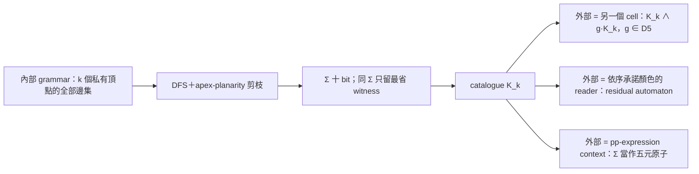

# C5 cell 窮舉器：C5 邊界＋密封內部＋只把邊界限制往外暴露

2026-09-13。使用者提問：C5 能不能當子結構——

$$
\boxed{\text{C5 boundary}+\text{內部結構}+\text{外部 attachments}}
$$

只把「內部對 C5 邊界造成的限制」暴露給外部，並為這個分解設計窮舉器。
本文件是設計說明加第一輪 $k\le5$ 的精確枚舉、以及用 reduction 跳過 $k=6,7$ 的觀察；程式為
`scripts/c5_cell_enumerator.py`（精確）與 `scripts/c5_cell_reduced.py`（reduction 版），
產物在 `artifacts/c5_cells/`。所有數字都是 **computationally observed**。
R1（低度內點刪除保 $\Sigma$）已在 `Math/LocalClosure.lean` 證明；catalogue 計數本身沒有 Lean 證書。
**§0 先給出 `bits` 的完整規格與「production 輸出 ≡ 規格」的獨立 checker（computationally verified，非 Lean）。**

## 0. 十 bit mask 的規格（specification）與 bridge 驗證

本節是 `cells.json` 裡 `bits` 這個數字的完整規格，以及「production 輸出 ≡ 規格」的獨立驗證。
被驗物件：`scripts/c5_cell_enumerator.py`；checker：`scripts/c5_sigma_bridge.py`；
報告：`artifacts/c5_cells/sigma_bridge.json`。信任層級：**computationally verified（有限域，清單見 §0.4）；
不是 Lean 證明，也不是對所有 $k$ 的定理**。本節只做表示／語意對齊，沒有新增數學搜尋結果，
也沒有更動任何 catalogue 數字（見 §0.5）。

### 0.1 cell graph 與 mask 的座標系

固定 $k\ge0$，內部私有頂點 $X=\{5,\dots,4+k\}$，邊宇宙

\[
U(k)=\underbrace{\{(0,2),(0,3),(1,3),(1,4),(2,4)\}}_{5\ \text{chords}}
\ \cup\ \underbrace{\{(i,5+m):0\le i<5,\ 0\le m<k\}}_{5k\ \text{boundary–interior}}
\ \cup\ \underbrace{\{(5+m,5+l):0\le m<l<k\}}_{\binom k2\ \text{interior–interior}}
\]

以固定 list 順序排（chords → 依 $m$ 再依 $i$ 的 attachments → 字典序 interior pairs），第 $j$ 條邊就是 bit $j$
（little-endian）。一個 mask $M$ 就是 $U(k)$ 的一個子集；**邊界 C5 $0$-$1$-$2$-$3$-$4$-$0$ 永遠存在、不佔 bit**。
`cells.json` 的 `edge_universe` 就是這份順序，`k_eff` 是 witness 實際用到的內部頂點數
（孤立內點不佔 bit，所以同一個 mask 可以對多個 $k$）。

### 0.2 一個 bit 的精確語義

$\mathrm{proper}(C_5)$ 是邊界五邊形的正常四色著色（240 個）。$S_4$ 是**全域**換色（boundary 與 interior 同時置換）。
$[b]$ 是 $b$ 的 $S_4$ orbit，代表元取字典序最小者——等價於 `boundary_relations.normalize` 的首次出現正規化。

`PATTERN_ORDER`（= `cells.json` 的 `pattern_order` = production `REPS` = 兩個 library 的同一順序）：

\[
[0,1,0,1,2]\ [0,1,0,2,1]\ [0,1,0,2,3]\ [0,1,2,0,1]\ [0,1,2,0,2]\ [0,1,2,0,3]\ [0,1,2,1,2]\ [0,1,2,1,3]\ [0,1,2,3,1]\ [0,1,2,3,2]
\]

\[
\Sigma(k,M)=\bigl\{\,[b]:\ b\in\mathrm{proper}(C_5),\ \exists x:X\to\{0,1,2,3\},\
\mathrm{proper}_{\,C_5\cup M}(b,x)\,\bigr\}
\]

\[
\mathrm{bit}_j(k,M)=1\iff \texttt{PATTERN\_ORDER}[j]\in\Sigma(k,M),
\qquad
\texttt{bits}(k,M)=\sum_{j=0}^{9}\mathrm{bit}_j(k,M)\,2^j
\]

**bit=1 的完整讀法**：這個邊界顏色類**至少有一個**合法內部延伸（含 chords、attachments、interior 邊）。
bit=0 是「一個都沒有」。它不是「所有延伸都長這樣」，也不是「外部一定配合得了」——
外部那半是另一層（§1 的 $R_A$、§2b 的 condition／residual）。
可行性對 orbit 良定義：若 $x$ 是 $b$ 的延伸，則 $\sigma\circ x$ 是 $\sigma\circ b$ 的延伸；
所以「用代表元測可行性」與「orbit 內任一元素可延伸」等價（§0.4 對每個 $k$ 抽 200 個接受節點實測）。

### 0.3 canonicalization：S4 進 key，D5 不進

| 作用 | 何時作用 | 實作 |
| --- | --- | --- |
| $S_4$ 全域換色 | **進** catalogue key：每個 bit 只記一個 orbit | `boundary_relations.normalize`（首次出現正規化） |
| $D_5$ 邊界重標 | **不進** key；只在外部對齊兩側標號時用 | `D5` pattern-index 置換表、`act_mask` |

因此 `bits` 是**帶標號**的 key（$b_0,\dots,b_4$ 固定，與既有 library 慣例相同）；
$k\le5$ 的 132 個 Σ 是 24 個 $D_5$ orbits，$D_5$ 商不改變 catalogue，也不改變任何一個 bit。

### 0.4 production 對照與 bridge 結果

| 規格 | production 實作 | 位置 |
| --- | --- | --- |
| $U(k)$ 的邊順序 | `edge_universe(k)` | `c5_cell_enumerator.py` L66–70 |
| `PATTERN_ORDER` | `REPS`（全部 proper C5 pattern 的 S4 代表元，排序；`assert len == 10`） | L38–40 |
| $[b]$ | `boundary_relations.normalize` | `boundary_relations.py` L12–14 |
| $\exists x$ 正常延伸 | `compat_tables`：每條邊對每個 pattern 的 $4^k$ 相容賦色 bitset；DFS 路徑上依序 AND | L73–88、L149 |
| $\mathrm{bit}_j$ = bitset 非空 | `bits = sum(1 << j for j, s in enumerate(surviving) if s)` | L125（`_record`） |
| graph 的邊集 | DFS 路徑 mask（`mask \| 1 << e`） | L139–153 |
| $\Sigma$ | `per_sigma` 的 key | L128 |

checker 用**兩條獨立路線**對撞：

* **reference（只用手寫定義）**：`ref_bits` 先枚舉 240 個 boundary colouring、再對 interior 做約束回溯；
  `ref_bitwise` 對十個 orbit 代表元各自獨立測可行性；`ref_bits_product` 暴力跑完 $4^{5+k}$ 個賦色。
  `PATTERN_ORDER` 與 $[b]$ 也在 checker 內用不同演算法重新推導（`orbit_rep` = 24 個置換取最小），
  再與 production `REPS`、`cells.json`、`boundary_relations/library.json`、`fan_pentagon/states.json` 的順序比對。
* **production**：`compat_tables` 的值域 + production `_record` 的 bit 編碼；DFS 模式更直接跑 production 的
  `enumerate_cells`，用 spy 掛在 `_record` 上，逐個接受節點取 mask——**連 AND 摺疊都是 production 自己的程式**。

指令與覆蓋（`--product` 額外用 $4^{5+k}$ 全枚舉交叉檢查 reference 自己）：

```bash
uv run --with networkx==3.5 --with rustworkx==0.17.1 python scripts/c5_sigma_bridge.py \
  --cases --product --catalogue --random 60 \
  --all-masks 0 --all-masks 1 --all-masks 2 --all-masks 3 --dfs 2 --dfs 3 --dfs 4
```

| 域 | 覆蓋 | 結果 |
| --- | --- | --- |
| $k\le3$ 全部 graph | $U(k)$ 的**每一個**邊子集（32／1,024／65,536／8,388,608 個，含非平面者） | 0 mismatch |
| $k=2$ DFS 接受節點 | 6,606／6,606（exhaustive，distinct Σ = 52 = $\lvert K_2\rvert$） | 0 mismatch |
| $k=3$ DFS 接受節點 | 312,067／312,067（exhaustive，distinct Σ = 87 = $\lvert K_3\rvert$） | 0 mismatch |
| $k=4$ DFS 接受節點 | 20,904,415／20,904,415（exhaustive，distinct Σ = 112 = $\lvert K_4\rvert$） | 0 mismatch |
| $k\le5$ catalogue | 132／132 個 witness（含空內部、chords-only、$k_{\mathrm{eff}}=1..5$），另重驗 apex-planarity | 0 mismatch |
| 手工極端 case | 20 個（$K_5$ 邊界、$K_4$ 邊界、空內部、孤立內點、內點 $K_4$／$K_5$、五點全 attach…） | 0 mismatch |
| 隨機 graph | 60 個（$k\le3$），reference 另與 $4^{5+k}$ 全枚舉對照 | 0 mismatch |

DFS 模式另對每個 $k$ 的前 200 個接受節點加驗 S4 orbit 不變性（orbit 內 24 個成員可行性一致）與
orbit-union 版 $\Sigma$，同樣 0 失敗；所有節點都是 `prod_bits` 與 `ref_bitwise` 的十個 bit 逐一相等。
整輪約 21 分鐘（$k=4$ 的 2,090 萬節點約 16 分鐘、$k\le3$ 全宇宙約 4 分鐘），exit code 0。

### 0.5 這條 bridge 的信任層級與界線

信任鏈（每一段都有對應的檢查，不是只有頭尾比對）：

$$
\text{graph}
\xrightarrow{\ \texttt{ref\_feasible}\ }
\text{boundary colouring feasibility}
\xrightarrow{\ \text{十個 orbit bit}\ }
\Sigma
\xrightarrow{\ \texttt{PATTERN\_ORDER}\ }
\text{10-bit encoding}
\xrightarrow{\ \texttt{prod\_bits}\,/\,\text{DFS spy}\ }
\text{enumerator output}
$$

* 這是 **executable checked／computationally verified**：有限域上的逐 bit 相等，**不是 Lean 定理**。
  Lean 裡只有一般性的 $\operatorname{Summary}$／$\Sigma$ 語義（`Math/Boundary.lean`、`Math/LocalClosure.lean`），
  **沒有**對應「十 bit 編碼」或 DFS 的 Lean 物件；本次沒有新增任何 Lean。
* $k\le3$ 是**全宇宙**（所有邊子集）；$k=4$ **只涵蓋 enumerator 接受的 20,904,415 個節點**（不是 $2^{31}$ 全宇宙）；
  $k=5$ 只涵蓋 catalogue witness 與手工 case，**不是** $2^{40}$ 全宇宙。$k\ge6$ 沒有精確枚舉，未驗。
* 幾何不在這條鏈上：apex-planarity 決定誰進 catalogue，不決定 $\Sigma$。checker 對 catalogue 重驗了
  disk 條件（NetworkX planarity），但「mask ≡ Σ」與 planarity 無關。
* 沒有驗到：SYM（內部標號正規化）、R1／R2 的實作、reduced $k=6,7$ 搜尋、$K_6=K_5$、$K_\infty=K_5$、
  D5 對齊下的 `Σ_in & g·Σ_out` 語義（只驗了 pattern 順序在四個檔案一致）。
  本文件其他地方對這些的保留不變。
* catalogue 數字沒有變：不重跑 enumerator、不改 `cells.json`；checker 反向從 witness 邊集重算 Σ，
  得到同一組 132 個 key 與同一組 nested 計數（11／22／52／87／112／132），
  並記錄 `cells.json` 的 sha256。

## 1. 答案：可以，條件是「密封」與「C5 在內側是 face」

把一個 **cell** 定義為

\[
\mathcal C=(B,\,I,\,A),\qquad B=(b_0,\dots,b_4)\text{ 有序 C5},\quad
I\text{ 內部圖（私有頂點 }X\text{、含畫在內側的 chords）},\quad
A\text{ 外部 attachments}.
\]

暴露給外部的唯一資料是

\[
\Sigma(I)=\{\,b\in\mathrm{proper}(C_5):\ \exists x:X\to\mathrm{Color},\ \mathrm{Proper}_{C_5+I}(b,x)\,\}
\]

依既有慣例壓成十個 S4-orbit bits（`pattern_order` 與 `boundary_relations` 相同）。

它是無損的，靠兩件事：

| 層 | 敘述 | 信任 |
| --- | --- | --- |
| 染色 | $R_{I\cup_B A}(b)\iff\Sigma(I)(b)\wedge R_A(b)$；內部變數 $x$ 未來不再被讀取時可存在量化 | proved in Lean：`summary_glue`、`seal_future`（[local_closure.md](local_closure.md) §1） |
| 幾何 | $I$、$A$ 各自是以 $C_5$ 為 face 的 disk patch 時，沿 $C_5$ 黏合永遠是平面圖，外部不需要知道內部畫法 | 標準組合拓撲（兩個 disk 沿邊界黏成球面），未 Lean 化，與既有 topology 信任範圍相同 |

所以「C5 能當子結構」的精確條件是：

1. **密封**：$X$ 不再接任何未來的邊、預染色或共享 frame。若內部還要施工，$x$ 仍是介面的一部分，不能只留 Σ。
2. **C5 是內側的 face**（apex-planarity 通過）。HANDOFF 記錄過的 11 頂點 BAD 圖裡 C5 是 separating cycle 但兩側非 disk 對齊時，同 Σ 的兩個 witness 有不同的 disk context 合法性；那種情況不是 cell，Σ 對幾何不無損。

在這兩個條件下，外部只看到「一個五端 hyper-constraint、內容是十個 bit」；
不同內部若 Σ 相同，對所有外部 context 都不可分辨（`replacement`）。

## 2. 窮舉器的分解

窮舉器不對「內部 × 外部」做乘積搜尋，而是分成三層，中間只以 Σ 相接：



### 2a. 內部窮舉（inner）

* **邊宇宙**：5 條 chords（畫在內側）、$5k$ 條 boundary–interior、$\binom k2$ 條 interior–interior；
  $|E|=5+5k+\binom k2$。
* **搜尋**：與 `fan_pentagon.py` 相同的遞增 bit DFS；加邊後對「圖＋接全部五個 boundary 的 apex」做
  Left–Right planarity；nonplanar 前綴的所有高位 supersets 一次剪掉。程式 assert 接受區間與拒絕前綴
  區間恰好鋪滿 $2^{|E|}$。
* **Σ 計算**：每條邊對每個 pattern 預先算「相容的 $4^k$ 內部賦色」bitset；沿 DFS 取 AND，
  Σ 的第 $j$ bit 就是第 $j$ 個 pattern 的 bitset 非空。chord $b_ib_j$ 對 $b_i=b_j$ 的 pattern 給 0。
* **去重**：只以 Σ 為 key。每個 Σ 記錄 labeled masks 數、內部重標下 canonical masks 數、
  最省 witness（先比實際用到的內部頂點數 $k_{\mathrm{eff}}$，再比邊數）。因為 $k_{\mathrm{eff}}$
  可小於 $k$，一次 $k$ 的搜尋直接給出 nested catalogue $K_0\subseteq K_1\subseteq\cdots\subseteq K_k$。
* **不做 D5 商**：catalogue 的 key 固定 $b_0..b_4$ 標號，與既有 library 相同；D5 只在外部對齊時使用。
* **平行**：`--jobs` 由父程序走前 12 個 edge bit，每個接受的前綴節點是一個子樹任務（848 個）；
  各任務的 accepted／rejected／coverage 分開累加，最後仍 assert 鋪滿 $2^{|E|}$。
  jobs=1 與 jobs=16 逐 cell 相同。

| $k$ | $|E|$ | $2^{|E|}$ | planarity calls | 秒 |
| ---: | ---: | ---: | ---: | ---: |
| 2 | 16 | 65,536 | 9,395 | 0.0 |
| 3 | 23 | 8,388,608 | 457,305 | 2.7（1 core） |
| 4 | 31 | 2,147,483,648 | 32,892,911 | 163（1 core）／13.7（16 cores） |
| 5 | 40 | 1,099,511,627,776 | 3,220,467,449 | 1,036（30 workers） |

### 2b. 暴露介面（exposure）

| 操作 | 意義 | 實作 |
| --- | --- | --- |
| `Σ(cell)` | 十 bit | inner 輸出 |
| `g·Σ`，$g\in D_5$ | 外部用另一種邊界標號時的對齊 | pattern index 置換表 `D5` |
| `Σ_in & g·Σ_out` | 兩側同時存在（`join`） | bit AND，語意由 `summary_glue` 保證 |
| `condition(Σ, Γ)` | 已承諾的 boundary 顏色／EQ-NEQ 條件 | pattern 篩選（既有 `Relation.condition`） |
| residual automaton | 外部依 $b_0,b_1,\dots$ 順序承諾顏色時 cell 剩下的狀態 | 對每個長度 $n$ 的 normalised prefix 取殘餘 mask |
| dead prefix | 某個本身可延伸成 proper C5 的前綴，殘餘為空 | cell 對承諾式外部的「局部 trap」 |
| nest | cell 裡面再有 cell | 外層內部是 annulus（十個 port），走 [pp 層](pp_relations.md)：$R_{\text{outer}}(b)=\exists c\,[R_{\text{ann}}(b,c)\wedge\Sigma_{\text{inner}}(c)]$ |

### 2c. 外部（outer）三種模式

1. **外部也是 cell**：separating C5 的可實現 Σ 集合就是 $\{\Sigma_1\wedge g\Sigma_2\}$；BAD、exact $T_4$
   都在這裡直接讀出，不必再枚舉 union graph。
2. **外部是承諾顏色的 reader**（strip／stepwise 模型）：cell 是一個帶十 bit 表的節點，
   每承諾一個 boundary 顏色就 `condition` 一次；它對外部狀態機的貢獻是有限個殘餘 mask。
3. **外部是 pp-expression**：Σ 當作五元原子 `R{bits}`，沿用既有求值器。

## 3. 第一輪觀察（精確枚舉 $k\le5$）

（`--k 3`、`--k 4`、`--k 5` 各跑一次；低層數字每次一致。）

| $k_{\mathrm{eff}}$ | 0 | 1 | 2 | 3 | 4 | 5 |
| --- | ---: | ---: | ---: | ---: | ---: | ---: |
| $|K_{k}|$（distinct Σ） | 11 | 22 | 52 | 87 | 112 | 132 |
| 新增 | 11 | 11 | 30 | 35 | 25 | 20 |

（本節全部是精確枚舉輸出。$K_6$、$K_7$ 見 §6，是**條件式**結論，前提寫在 §6.0。）

**與既有 library 的關係。** 原 K3 grammar 的 42 個 Σ 全部在 $K_3$；內部五邊形 grammar 的 87 個 Σ
有 52 個在 $K_3$、77 個在 $K_4$、全部 87 個在 $K_5$。$K_3$ 也恰好 87 個，是巧合，集合不同。

**三色 profile。** 既有兩個 grammar 都禁 chords，觀察到「至少接受兩個三色 pattern，且恰兩個時相鄰」。
允許 chords 後這兩條都不成立：

* $k_{\mathrm{eff}}=0$、兩條同端 chords（例如 `[0,2],[0,3]`，Σ=960）恰接受一個三色 pattern——
  singleton 在 chord 的公共端點。五個這樣的 cell 就是五個 profile-1 狀態。
* $k_{\mathrm{eff}}=3$ 起出現 profile 為兩個不相鄰 singleton 的 cell（Σ=429：profile $\{2,4\}$）。
* 沒有 Σ 為空或不含三色 pattern 的 cell（與 apex 論證一致：cell＋apex 是平面圖，4CT 給三色邊界；
  這裡只是 $k\le4$ 的有限驗證）。

**Separating C5（cell ∧ D5-對齊的 cell）。** $k\le3$：798 個不同 meet、沒有空 meet、31 個 BAD meet、
exact $T_4$ 有 200 組對齊配對。最便宜的 BAD 是 $0+0$ 個內部頂點：一側 chord `[0,2]`（Σ=1016）、
另一側 chords `[0,3],[1,3]`（Σ=774），union 是 boundary 上的 $K_4$；這正是 HANDOFF 記錄的最小
$(5,8)$ BAD。exact $T_4$ 需要 $3+3$，與先前 11 頂點結果一致。$k\le4$ 的 meet 增到 938 種，但 BAD meet 仍是 31 個、exact $T_4$ 仍是 200 組：第四個內部頂點沒有新的 BAD 組合。$k\le5$：meet 達到全部 1,023 個非空 mask
（任何非空 Σ 都是兩個 cell 的 D5 對齊交集），BAD meet 與 exact $T_4$ 仍是 31／200。

**Residual automaton。** $k\le3$：所有 cell 所有前綴的殘餘 mask 只有 142 種；除 Σ=1023（空內部）外
每個 cell 都有 dead prefix；最早的 dead prefix 長度 3（例如 chord `[0,2]` 的 cell 在 $b_0=b_2$ 承諾後
即死）。$k\le4$：171 種殘餘 mask、112 個 cell 中 111 個有 dead prefix、最早仍是長度 3；$k\le5$：193 種、131／132。
這是 cell 放進承諾式外部時需要攜帶的全部狀態：有限、且遠小於 $2^{10}$。

## 4. 對 stepwise／strip 模型的意義

* 在 [§9k](stepwise_state_sufficiency.md) 的 committed-colour strip 裡，trap 是「forced cone 中已註定的碰撞」。
  cell 的 dead prefix 是同一類現象的最小版本：boundary 顏色一個個承諾，內部（已密封、不再有自由）
  在某個前綴後無法完成。差別是 strip 的內部不是密封的（後續 layer 還會接進來），所以那裡不能只留 Σ。
* 若在 strip 裡指定一個 5-cycle，其內側**不再施工**，就可以把該側換成 cell；外部狀態機只多帶一個殘餘 mask。
  這是把 §9k 的 trap 判準模組化的一條路：先把「會死的子結構」封成 cell，再由 outer reader 判斷。
* 尚未做：從 strip grammar 自動抽出可密封的 5-cycles；strip 的 fan 結構通常讓 C5 帶 chords，
  需要先確認內側確實是 disk。

## 5. 界線與後續

* 精確枚舉止於 $k=5$（$2^{40}$）；$k=6,7$ **跑不動**，只有 §6 的 reduction 版，其「新 Σ 完整」是
  條件式（§6.0：R1 與 SYM 的核心已 Lean 化；仍依賴 SYM 的鴿籠步驟與程式正確，只在 $k\le5$ 經驗驗證），labeled 計數在那個模式下也**不是**全宇宙計數。
  $k\ge8$ 需要把 R2 變成生成階段的剪枝，或改走 near-triangulation → 邊子集；未實作。
* R1（低度內點刪除保 $\Sigma$）已有 Lean 證書；catalogue 本身與 $k=6,7$ reduced 搜尋沒有 Lean 證書。`--check` 以 NetworkX planarity 與全染色 brute force 獨立重驗每個 witness 的 Σ 與 disk 性質；§0 的 `c5_sigma_bridge.py` 另外把「十 bit mask ≡ Σ」逐 bit 對齊（$k\le3$ 全宇宙、$k=4$ 全部接受節點、$k\le5$ 全部 witness）。
* catalogue key 未取 D5 商（$k\le5$ 的 132 個 Σ 是 24 個 D5 orbits），與既有 library 慣例一致。
* nested cell 的 annulus relation（十個 port）尚未枚舉；pp 求值器有十個變數的上限，剛好夠一層。
* 內部非密封、或 C5 在內側非 face，都不是 cell；不得把 Σ 當成那些情況的充分狀態。

## 6. 用 $k\le5$ 找 reduction，跳過 $k=6,7$

問題：精確枚舉在 $k=5$ 花 17 分鐘（$2^{40}$），$k=6$ 是 $2^{50}\approx1.1\times10^{15}$，
$k=7$ 是 $2^{60}$——**精確枚舉在 $k\ge6$ 是跑不動的**，不是慢，是不可行。
目標只是 Σ 的 catalogue，所以可以丟掉「Σ 已在 $K_{k-1}$」的圖。從 $k\le5$ 的資料抽出三條規則
（`scripts/c5_cell_reduced.py`）：

### 6.0 前提：$K_6=K_5$、$K_7=K_5$ 是**條件式**結論

**$k\ge6$ 沒有任何精確枚舉結果。** 下面的 $k=6,7$ 數字全部來自 reduced 搜尋，其正確性依賴三件事：

| # | 前提 | 狀態 |
| --- | --- | --- |
| 1 | **R1 引理**：內部頂點 $v$ 若 $\deg(v)\le3$，則 $\Sigma(G)=\Sigma(G-v)$ | **proved in Lean**：`summary_eq_deletePrivate`（一般 boundary）、`sigma_eq_delete_private`（C5 形式）；只對「內點」用，boundary 固定不動 |
| 2a | **SYM 的核心：$\Sigma$ 與內部標號無關** | **proved in Lean**：`Sigma_relabel`／`sigma_iff_relabel`（`Math/SymRelabel.lean`），見 §7 |
| 2b | **SYM 的排序步驟**：每個 unlabeled 圖都有一個「attachment mask 非遞增」的代表 | **proved in Lean**：`FiveBoundary.Sym.exists_sorted_relabel`（`Math/SymNormalForm.lean`），任意 $k$，包含 mask 搬運與同 $\Sigma$；見 §7.2 |
| 3 | **程式正確實作 1 與 2** | 只在 $k\le5$ 以精確枚舉驗證（`matches_exact_catalogue: true`）；另有 §7 的 SYM 專用 checker；這些都是經驗驗證，不是證明；**2026-09-15 起另有 §16 的獨立重現**：不用 SYM、不同邊序、不同 planarity／Σ 實作的 C++ 搜尋在 $k=6$ 得到同樣的 132 個 Σ、零新 Σ |

（§0 的 bridge 與前提 3 **不是同一件事**：bridge 只保證「給定一張圖，十 bit 的讀寫與 $\Sigma$ 一致」，
不保證 reduced 搜尋的 degree 剪枝與 SYM 正規化正確，因此不改變本節的條件式地位。）

R1 的證明（現已 Lean 化）：$G-v$ 的任何正常染色限制到 $G$ 還是正常的，故 $\Sigma(G)\subseteq\Sigma(G-v)$；反向地，$G-v$ 的染色留給 $v$ 的鄰居至多 3 色，四色中必有一色可用，故 $\Sigma(G-v)\subseteq\Sigma(G)$。
因此**若前提 1–3 成立**，第 $k$ 層的新 Σ 只可能來自「每個內點 degree $\ge4$」的圖，
$K_k=K_{k-1}\cup\Sigma(\text{倖存者})$ 就是完整的，$K_6=K_5$ 也就成立。

**反面必須寫清楚**：R1、SYM 的 $\Sigma$ 不變性與排序代表存在性（2b）都已有 Lean 證明；剩下的是程式實作（3）。實作若有誤，現有資料仍不足以保證 $K_6=K_5$。目前**沒有**獨立的 $k=6$ 精確枚舉可以對照
（那正是它跑不動的原因），所以這個結論的信任層級低於 §3 的 $k\le5$ 精確數字，
也低於 R1 這條 Lean 證書。§6 表格的「新 Σ」欄一律讀作「reduced 搜尋所到範圍內的新 Σ」。

$k\le5$ 的比對（`matches_exact_catalogue`）現在是程式（與 SYM）的**經驗驗證**：R1 引理本身已 Lean 化，
比對失敗只會指向實作或 SYM，而不是 lemma。但它只驗證到 $k=5$——一個「$k=5$ 時 degree $\le3$ 可刪，
$k\ge6$ 卻需要 degree $\ge5$」的錯誤實作不會被這筆資料抓到。這是 $K_6=K_5$ 與 $K_{\le5}$ 精確結果之間
最實在的差距。

R2 不參與 $K_6=K_5$：它只把舊 Σ 的倖存者歸類（$k\le6$ 全部可約、新的全部不可約），是診斷，
不是這個結論的前提。

| 規則 | 敘述 | 為什麼保 Σ | 用法 |
| --- | --- | --- | --- |
| R1 | 內部頂點 degree $\le3$ | 最後再染它，永遠有色：$\Sigma(G)=\Sigma(G-v)$ | 邊序改成「每個內部頂點一個 block」，degree 定案就剪枝（單調） |
| SYM | 內部頂點的五 bit attachment mask 非遞減 | **保 Σ**：`Sigma_relabel`（§7）；「任何內部圖都可以這樣重標」是獨立的鴿籠事實（§7，Python 驗證） | 剪枝（每個 unlabeled 圖至少留一個） |
| R2 | 長度 $\le5$ 的 cycle 把非空內部集合 $S$ 與 boundary 隔開，且 inside relation 有 $<|S|$ 個頂點的 disk 實現 | inside 換成較小實現：Lean `replacement` 保 Σ，cycle 內側清空後再黏 disk patch 保平面 | 葉子過濾（不單調，加邊可能破壞分隔） |

R2 用到的 inside relation 目錄就是 cell catalogue 自己：C3 永遠可清空、C4 的 7 個關係（$\le3$ 頂點）由
`c4_catalogue` 現算、C5 用 `cells.json` 的 $k_{\mathrm{eff}}$。所以這是自舉：$K_{\le k-1}$ 決定第 $k$ 層哪些圖可跳過。

**Computationally observed（`--r2`）：** $k=3,4,5$ 的 R1+SYM 倖存者分成兩類，剛好互補——Σ 舊的全部
R2-可約，Σ 新的全部 R2-不可約：

| $k$ | 精確 DFS 節點 | R1+SYM 節點 | 倖存者 | 其中 Σ 舊（全 R2-可約） | Σ 新（全不可約） | 新 Σ（條件式，見 §6.0） | 秒 |
| ---: | ---: | ---: | ---: | ---: | ---: | ---: | ---: |
| 3 | 3.1×10⁵ | 9,514 | 205 | 125 | 80 | 35 | 0.1 |
| 4 | 2.1×10⁷ | 1.8×10⁵ | 1,920 | 1,860 | 60 | 25 | 0.3 |
| 5 | 1.9×10⁹ | 3.3×10⁶ | 28,781 | 28,706 | 75 | 20 | 2.6 |
| 6 | （$2^{50}$） | 7.1×10⁷ | 593,212 | 593,212 | 0 | **0** | 66 |
| 7 | （$2^{60}$） | 1.9×10⁹ | 1.69×10⁷ | 未跑（倖存者過多） | 0 | **0** | 2,156 |

三個訊號：

1. **R1+SYM 把 $k=5$ 從 17 分鐘壓到 2.6 秒、$k=6$ 從 $2^{50}$（不可行）壓到 66 秒、$k=7$ 從 $2^{60}$ 壓到 36 分鐘**，
   且 $k\le5$ 的新 Σ 與精確枚舉逐一相同（`matches_exact_catalogue`）。這就是「用 $k\le5$ 跳過大部分 $k=6$」的答案：
   不是 C++，是 degree 剪枝加標號正規化。前提與信任層級見 §6.0。
2. **$K_6=K_5$、$K_7=K_5$（條件式）**：在 §6.0 的前提 1–3 下，第六、七個內部頂點都不產生任何新 Σ。
   新增序列 11, 11, 30, 35, 25, 20, 0, 0。這兩個等號**不是**精確枚舉的輸出，而是 reduced 搜尋加上
   R1 引理的推論；沒有可對照的 $k=6$ 精確結果。$K_\infty=K_5$（132 個 Σ、24 個 D5 orbit）更弱，仍是 **conjectured**：
   有限層飽和不是證明，而且就算 R1 成立，$k\ge8$ 的倖存者仍指數成長（$k=7$ 已 1.9×10⁹ 節點、36 分鐘），
   R1／R2 也不構成 unavoidable set（大 patch 可以每個內點 degree $\ge5$ 且無短分隔環）。
3. **不可約圖極少**：每層的不可約倖存者數 ≈ 新 Σ 數 × SYM 平手倍數，也就是每個新 Σ 基本上只有一個
   unlabeled 不可約實現。若要衝 $k\ge8$，正確的目標是直接生成不可約圖（R1 單調剪枝已在；R2 需要
   在生成階段用「已分隔的 $S$ 不會再接出去」的單調子情況），而不是加速全宇宙 DFS。

`reduced_k{k}.json` 保存每個倖存 Σ 的計數與最省 witness、R2 統計與 C4 目錄；labeled 計數在這個模式下
**不是**全宇宙計數，只有新 Σ 集合是完整的。

## 7. SYM：內部標號正規化（proved in Lean ＋ 窮舉 checker）

使用者要求：證明重新標號 interior vertices 不改變 C5 boundary-colouring feasibility，因此不改變
10-bit Σ key；並核對 production enumerator 的 canonicalization 是否只依賴此等價。
本節只做 SYM，**不碰 R1、R2、$k\ge6$、$K_6=K_5$，也不改 catalogue**。

### 7.1 Lean：$\Sigma$ 與內部標號無關

`Math/SymRelabel.lean`（namespace `FiveBoundary.Sym`；公理審計
`artifacts/sym_relabel/lean-audit.txt`）。設 $G$ 是 $\mathrm{Fin}\,n$ 上的 simple graph，$B$ 是五點
boundary injection，$\pi$ 是**固定 boundary 逐點**的置換，`relabel π G := G.comap π`。

| 定理 | 內容 | 信任 |
| --- | --- | --- |
| `Sigma_relabel` | $\pi$ 固定 $B$ 的點時 $\Sigma(\texttt{relabel}\,\pi\,G)=\Sigma(G)$ | 普通證明 |
| `Sigma_relabel_interior` | cell 座標 $\mathrm{Fin}(5+k)$、boundary `firstBoundary` 的特例 | 普通證明 |
| `sigma_iff_relabel` | 逐 bit 形式：$b\in\Sigma(\texttt{relabel}\,\pi\,G)\iff b\in\Sigma(G)$ | 普通證明 |
| `Sigma_relabel_eq` | 兩個固定 boundary 的 relabelling 給同一個 $\Sigma$ | 普通證明 |
| `proper_relabel` | $\mathrm{Proper}(\texttt{relabel}\,\pi\,G)\,c\iff\mathrm{Proper}\,G\,(c\circ\pi^{-1})$ | 普通證明 |
| `patternOrder_length` / `patternOrder_toFinset` | 十個 pattern 的順序與 `colorReps` 一致、恰十個 | `native_decide` |

證明就是「重標是 graph 的自同構」：$c\mapsto c\circ\pi^{-1}$ 是 $G$ 的正常染色與
$\texttt{relabel}\,\pi\,G$ 的正常染色之間的雙射；因為 $\pi$ 固定 boundary，
$\texttt{boundaryColoring}\,B\,(c\circ\pi^{-1})=\texttt{boundaryColoring}\,B\,c$，兩邊的
boundary projection 相同，故 $\Sigma$ 逐元素相等。**推論**：十 bit 的每一個 bit（「這個 boundary
pattern 至少有一個合法內部延伸」）是 unlabeled 內部的性質，不是編號的性質；因此同一個 unlabeled
圖的任兩個標號有相同的十 bit 輸出，reduced enumerator 用它當 key 是合法的。

公理依賴：上表前五條只有 `propext`／`Quot.sound`（`patternOrder_*` 另有 `native_decide` 的計算公理），
沒有 `sorryAx`。

### 7.2 任意 $k$ 的 attachment mask 搬運與排序代表（2026-09-14 已 Lean 化）

`SYM` 在程式裡是「內點的五 bit attachment mask 非遞增」這一條剪枝，它的合法性由兩件事組成：

1. **搬運**：`attMask G B v = ∑ i, if G.Adj (B i) v then 2^i else 0`。
   `attMask_relabel` 證明固定 boundary 的 pullback 重標滿足
   $a_{\mathrm{relabel}\,\pi\,G}(v)=a_G(\pi(v))$。
2. **存在**：`interiorPerm σ` 在 $\mathrm{Fin}(5+k)$ 上逐點固定 boundary，將新內點 $m$ 對應到舊內點
   $\sigma(m)$。`exists_sorted_relabel` 用數值順序的對偶排序取得 $\sigma$，使新圖的 masks 非遞增，
   並同時證明新圖與原圖的完整 $\Sigma$ 相等。對任意 $k$ 成立，含 $k=0$ 與相同 mask 的情況。

定理在 [Math/SymNormalForm.lean](../Math/SymNormalForm.lean)，由 `Math.lean` 匯入；
公理審計入口 `Math/SymNormalFormAudit.lean`，輸出保存於
`artifacts/sym_relabel/normal-form-lean-audit.txt`。這是普通 Lean 證明，不依賴 `native_decide`。
§7.1 的定理不依賴此新模組；Python 的 bit 座標與 DFS 執行仍是分開的信任層。

**修正先前說法：** 多重集不變不代表目前順序的 sortedness 不變。SYM 一般會拆開 orbit，
要求是**每個 orbit 至少保留一個代表**，不是 orbit union，也不要求恰好一個代表。

### 7.3 Checker：`scripts/c5_sym_check.py`

只讀 `cells.json`，從 edge universe 獨立重算，不寫任何 enumerator 產物。報告
`artifacts/c5_cells/sym_check.json`（`--quick` 寫 `sym_check_quick.json`）。

| 檢查 | 內容 |
| --- | --- |
| `A0` | production 的 per-vertex block 順序（`att_value`）與 $U(k)$ 的 bit 順序描述同一組五 bit mask |
| `A1` | production `interior_perm_maps` ≡ 獨立寫的 relabel map；生成集合對合成與反元素封閉、階數為 $k!$ |
| `A2` | mask 的多重集在 relabelling 下不變（抽樣 relabelling 逐個比對） |
| `A3` | **全宇宙**：每張圖都存在非遞增 relabelling（`without_sorted_relabel = 0`） |
| `A4` | 每個 orbit 至少有一個 SYM 代表；與「attachment mask 值非遞增」及 production 逐圖相同；orbit 被拆開只是統計，並非錯誤 |
| `A4'` | 在 R1 倖存者中，每個 orbit 至少有一個 `SYM` 代表（剪枝不丟任何 unlabeled 圖） |
| `A5` | `cells.json` 的 `canonical_masks` 是 orbit 最大值計數：每個 orbit 恰有一個 canonical mask |
| `A5'` | catalogue 的 132 個 witness 中 $k_{\mathrm{eff}}\le3$ 的 76 個，其 `canonical_masks` 與 orbit 最大值一致 |

`A0` 是必要的座標校正：$k\ge3$ 時 production 的 per-vertex block 在 mask 裡**不連續**
（前面 block 的 interior–interior 邊插在中間），所以「用 $U(k)$ 的 bit 順序讀 mask」與
「用 production 的 block 偏移讀 mask」是兩套座標；checker 兩套都算並逐圖比對，確認它們描述同一組
mask，之後才比較 `sym_ok`（$U(k)$ 順序）與 `prod_sym_ok`（production 順序）。

`A4` 順帶釘死一件事實：production 讀的是 **attachment mask 原始五 bit 值**的非遞增
（`att_value`），與「attachment 數目」的非遞增互不蘊含；兩者在 $k\ge2$ 就會分歧
（$k=2$：65,536 張中有 14,080 張不同），checker 兩種讀法都驗，兩者都 `orbits lost = 0`。

2026-09-14 重驗：$k=2$ 的 33,792 個 orbit 中，31,744 個被 SYM 拆開，但 **0 個丟失**；
numeric-only 圖 3,520 張，size-only 圖 10,560 張。例如 masks `(16,15)` 只通過數值排序，
`(15,16)` 只通過數目排序。舊版 A3 誤用數目排序，已改成數值排序；A3／A4 的代表丟失與 A4
production／規格 mismatch 現在會拋錯，不能僅列出失敗數字後正常結束。
此次重建 `sym_check_quick.json`（$k=0,1,2$ 全宇宙）；`sym_check.json` 保留為舊版 $k=2,3$ 歷史報告，
其中 `value_spec_stricter_than_size` 不應作數學解讀，A3 也不應當作數值排序的新版驗證。

```bash
uv run --with rustworkx==0.17.1 --with networkx==3.5 python scripts/c5_sym_check.py --quick   # k<=2 全宇宙 ＋ catalogue
uv run --with rustworkx==0.17.1 --with networkx==3.5 python scripts/c5_sym_check.py --k 2 --k 3   # ＋ k=3 全宇宙（8.4M 圖）
```

### 7.4 界線

* SYM 的圖層不變性與排序存在性已 **proved in Lean（§7.1–7.2）**；Python 實作仍由 §7.3 分開檢查。
* 沒有動 R1、R2、$k\ge6$ 搜尋、$K_6=K_5$、catalogue 定義或任何 `cells.json` 內容。
* $k=4,5$ 的 orbit 檢查**沒跑**：production 的 `interior_perm_maps` 只在 $k\le3$ 建表，
  $k=4$ 是 $24$ 個置換、$k=5$ 是 $120$ 個，全宇宙 $2^{31}$／$2^{40}$ 不可行；
  §7.1–7.2 的 Lean 定理對所有 $k$ 成立；未做大 $k$ 的 Python 全宇宙檢查。
* §7.1 只說「$\Sigma$ 是 relabelling 不變量」；「catalogue 不取 D5 商」、「mask 是帶標號 key」等既有
  保留不變。

## 8. 檔案與重現

```bash
uv run --with rustworkx==0.17.1 --with networkx==3.5 python scripts/c5_cell_enumerator.py --k 5 --jobs 30   # 17 min → cells.json
uv run --with networkx==3.5 python scripts/c5_cell_enumerator.py --check                                    # 獨立重驗每個 witness
uv run --with networkx==3.5 --with rustworkx==0.17.1 python scripts/c5_sigma_bridge.py --quick          # ~20 s → sigma_bridge_quick.json
uv run --with networkx==3.5 --with rustworkx==0.17.1 python scripts/c5_sigma_bridge.py \
  --cases --product --catalogue --random 60 --all-masks 0 --all-masks 1 --all-masks 2 --all-masks 3 --dfs 2 --dfs 3 --dfs 4   # 十 bit mask ≡ Σ（§0）→ sigma_bridge.json
uv run --with rustworkx==0.17.1 python scripts/c5_cell_reduced.py --k 5 --jobs 30 --r2                      # 3 s → reduced_k5.json
uv run --with rustworkx==0.17.1 python scripts/c5_cell_reduced.py --k 6 --jobs 30 --r2                      # ~2 min → reduced_k6.json
```

`cells.json`：`pattern_order`、`edge_universe`、`search`（accepted／rejected／calls／coverage）、
`nested_by_k_eff`、profile 統計、與兩個既有 library 的比對、`separating_c5`、`residual`，
以及每個 Σ 的 `k_eff`、最省 witness 邊集、labeled／canonical 計數、三色 profile、dead prefixes。
`sigma_bridge.json`：十 bit 的規格、逐域覆蓋與逐 bit 比對結果（§0.4）；bridge 只讀 `cells.json`，不寫它。
`--quick` 寫的是 `sigma_bridge_quick.json`（$k=0..2$ 全宇宙＋$k=2,3$ DFS＋catalogue＋case＋30 個隨機 graph），
不會覆蓋完整報告。

## 9. Reduced DFS 的完整性證明（嚴格限制在 `c5_cell_reduced.py` 的 R1+SYM search path）

2026-09-14 更新：下文是先前的紙面論證；其中 mask 搬運與排序代表存在性現已在 §7.2 Lean 化。
下文「尚未形式化」的歷史說明由此更新取代。前綴切分另見 §10；DFS 剪枝與 production 實作
未因此自動形式化。

使用者提問：核對 `scripts/c5_cell_reduced.py` 的 R1+SYM DFS 是否真的完整——即每一個
「degree $\ge4$」（R1-倖存）的 unlabeled 內部圖，DFS 是否保證至少走訪並記錄一個標號代表。
本節**只**證明這件事，不碰 R2、`enumerate_reduced` 的前綴平行化與 §6.0 前提表格第 3 項
（程式實作本身沒有 bug）、也不碰 $K_6=K_5$。證明是普通數學論證（鴿籠＋二進位單調＋對程式結構的
直接歸納），**不是 Lean**；§7.2 已指出的「SYM 鴿籠步驟未 Lean 化，只用窮舉 checker 驗證」現在多了
一條與 $k$ 無關的一般證明（下面的引理 2），但仍未寫進 `Math/SymRelabel.lean`。

### 9.0 記號（對齊 `block_edge_order`／`viable`／`_dfs`，L49–L130）

固定 $k$。`block_edge_order(k)`（L49–59）把 $E=5+5k+\binom k2$ 條邊排成：索引 $0..4$ 是 5 條
chords；然後對 $m=0,\dots,k-1$ 依序 append 區塊 $m$，佔索引 $[\mathrm{first}_m,\mathrm{last}_m]$：
先 5 個 attachment bit（偏移 $i$ ↔ 邊 $(i,x_m)$，$i=0..4$，$x_m:=5+m$），再 $m$ 個 back-edge bit
（偏移 $l$ ↔ 邊 $(x_l,x_m)$，$0\le l<m$）。對 mask $M\in\{0,1\}^E$（等同 $U(k)$ 的一個邊子集）定義：

* $a_m(M):=(M\gg\mathrm{first}_m)\bmod32$ —— 區塊 $m$ 的 5-bit attachment 值，即 `att_value(M,m)`（L79–81）；
* $\mathrm{touch}_m\subset\{0,\dots,E-1\}$ —— 與 $x_m$ 相連的**全部**邊索引（區塊 $m$ 自己的 attachment／
  back-edge bit，加上所有 $m'>m$ 的區塊裡 $(x_m,x_{m'})$ 那個 back-edge bit），這是 `_W['touch'][m]`（L73），
  與 $M$ 無關、只依賴 $k$；$d_m(M):=\mathrm{popcount}(M\wedge\mathrm{touch}_m)$ 是 $x_m$ 在 $M$ 裡的 degree；
* $\mathrm{R1}(M)$：$d_m(M)\ge4$ 對每個 $m$；$\mathrm{SYM}(M)$：$a_0(M)\ge a_1(M)\ge\cdots\ge a_{k-1}(M)$；
* relabelling：對 $\rho\in\mathrm{Sym}(\{0,\dots,k-1\})$，$\rho\cdot M$ 是把每個內部頂點 $x_m$ 改名成
  $x_{\rho(m)}$（boundary $0..4$ 與 chords 不動）後得到的邊子集，重新用同一套 $U(k)$ 座標表示。

**觀察 0（DFS 不變量）。** 在 `_dfs(mask,start,stop,...)`（L115–130）的 for 迴圈跑到變數 $e$ 時，
`mask` 的位元 $<e$ 已經「決定」（本次或祖先呼叫加入的記為 1，跳過的記為 0），位元 $\ge e$ 恆為 0——
因為 mask 只在遞迴進入下一層（`mask | 1 << e`）時才會把位元 $e$ 設成 1，而下一層的 `start` 一定是
$e+1$，故任何已設為 1 的位元索引必 $<$ 目前呼叫關心的 loop 變數。對呼叫深度歸納即得。
`viable(mask,e)`（L84–96）的每一次呼叫都在此不變量下發生。

### 9.1 引理 1（attachment mask 的搬運，對應提問 1）

對任意 $\rho\in S_k$ 與任意 $M$，$a_{\rho(m)}(\rho\cdot M)=a_m(M)$（從而 $d_{\rho(m)}(\rho\cdot M)=d_m(M)$）
對每個 $m$ 成立。

**證明。** $a_m$ 只讀「boundary 頂點 $i$（$i=0..4$）是否與 $x_m$ 相鄰」這五個 bit；relabelling 逐點固定
boundary（只改內部頂點的名字），所以「$i$ 與新頂點 $x_{\rho(m)}$ 相鄰」等價於「$i$ 與舊頂點 $x_m$ 相鄰」——
這正是 `Math/SymRelabel.lean` 已證的 `relabel_adj`（$(relabel\,\pi\,G).Adj\,u\,v\iff G.Adj(\pi u,\pi v)$）
取 $u=i$（$\pi$ 固定的 boundary 點）、$v=x_m$ 的直接特例，該檔案 §3 的註解已指出這條推論但未展開；
這裡把它在 reduced enumerator 自己的座標系（block edge order，`att_value` 讀的座標）裡寫出來。
degree 版本同理：$\mathrm{touch}_m$ 的每條邊（boundary–interior 或 interior–interior）在 relabelling 下
逐條搬到 $\mathrm{touch}_{\rho(m)}$ 的對應邊（$\rho$ 是雙射，interior–interior 邊 $(x_l,x_m)$ 搬到
$(x_{\rho(l)},x_{\rho(m)})$ 仍是合法邊），故整個鄰域搬運，popcount 不變。$\blacksquare$

### 9.2 引理 2（非遞增代表必存在，對應提問 2）

對任意 $M$，存在 $\rho\in S_k$ 使 $\mathrm{SYM}(\rho\cdot M)$ 成立；且 $\rho\cdot M$ 與 $M$ 同為
apex-planar、同滿足或同不滿足 $\mathrm{R1}$（即 $\rho\cdot M$ 仍是合法圖，且是否 R1-倖存不變）。

**證明。** 取 $\rho^{-1}$ 為把數列 $(a_0(M),\dots,a_{k-1}(M))$ 排成非遞增的任一置換（任何有限整數
數列都可排序；同分時任取一種破法，例如原索引小者排前面）。由引理 1（$m:=\rho^{-1}(j)$ 代入
$a_{\rho(m)}(\rho\cdot M)=a_m(M)$），$a_j(\rho\cdot M)=a_{\rho^{-1}(j)}(M)$，故
$a_0(\rho\cdot M)\ge a_1(\rho\cdot M)\ge\cdots\ge a_{k-1}(\rho\cdot M)$，即 $\mathrm{SYM}(\rho\cdot M)$。
$\mathrm{R1}$ 部分由引理 1 的 degree 版本（$d_m$ 的多重集不變，R1 是「每個都 $\ge4$」，與標號無關）。
apex-planarity 不變是因為 relabelling 只是把圖的頂點重新命名（boundary 與 apex 完全不動的圖同構），
不改變「加上 apex 是否平面」這個與標號無關的性質。$\blacksquare$

（這比 §7.2／`c5_sym_check.py` 的 `A3` 多了一步：`A3` 只在小 $k$ 的全宇宙上窮舉驗證存在性；
這裡的排序論證對任意 $k$ 都成立，是一般數學事實，不需要窮舉。它仍然只是普通證明，不是 Lean。）

### 9.3 引理 3（區塊定案結構，對應提問 4）

`block_edge_order` 依 $m=0,1,\dots,k-1$ 依序 append 區塊，故 $\mathrm{first}_m$ 嚴格遞增，且
$\mathrm{first}_m=\mathrm{last}_{m-1}+1$。因此對任意 $e$ 與任意 $m$，只要 $\mathrm{first}_m<e$
（即 `viable` 的迴圈跑到了 $m$）：區塊 $0,\dots,m-1$（連同 5 條 chords）的所有邊索引都 $<e$。

**證明。** 直接由構造：$\mathrm{first}_m<e\Rightarrow\mathrm{last}_{m-1}=\mathrm{first}_m-1<e$，
而區塊 $0,\dots,m-1$ 的索引都 $\le\mathrm{last}_{m-1}$（區塊依 $m$ 遞增排列）。$\blacksquare$

**推論（程式假設的「已定案／尚可改變」）。** 在觀察 0 的不變量下，只要 $\mathrm{first}_m<e$，
`att_value(mask,m-1)`（L94 讀的值）就是**任何**與 mask 在 $[0,e)$ 一致的延伸圖裡 $x_{m-1}$ 的
**最終**值——因為區塊 $m-1$ 已整段 $<e$、不會再被改變；而 `att_value(mask,m)` 只是延伸圖裡 $x_m$
最終值的一個**下界**（區塊 $m$ 裡 $\ge e$ 的位元目前讀作 0，延伸可能把某些改成 1，二進位值只增不減）。
這正是程式（L94 的比較只對 $m-1$ 用「確定值」、對 $m$ 用「目前值」）默認、也是使用者第 4 點要求核對的
不對稱假設；引理 3 證明了它成立。

### 9.4 命題 4（early-prune 的可靠性，對應提問 3）

在觀察 0 的不變量下，若 `viable(mask,e)`（L84–96）回傳 `False`，則不存在任何延伸
$M\supseteq(\mathrm{mask}\cap[0,e))$（即 $M$ 在 $[0,e)$ 上與 mask 相同，$[e,E)$ 任意）同時滿足
$\mathrm{R1}(M)$ 與 $\mathrm{SYM}(M)$。

**證明。** `viable` 對每個 $\mathrm{first}_m<e$ 的 $m$ 有兩種可能觸發 `False` 的條件（L92、L94）：

**(a)** $\mathrm{popcount}(\mathrm{mask}\wedge\mathrm{touch}_m)+\mathrm{undecided}_m(e)<4$，其中
$\mathrm{undecided}_m(e):=\mathrm{popcount}(\mathrm{touch}_m\gg e)$ 是 $\mathrm{touch}_m$ 裡位置 $\ge e$
的位元數。任意延伸 $M$ 的 $d_m(M)=\mathrm{popcount}(M\wedge\mathrm{touch}_m)\le
\mathrm{popcount}(\mathrm{mask}\wedge\mathrm{touch}_m)+\mathrm{undecided}_m(e)<4$（$M$ 在 $\ge e$ 部分
至多把那 $\mathrm{undecided}_m(e)$ 個位元全設成 1）。故每個延伸都有 $d_m(M)<4$，$\mathrm{R1}$ 對每個
延伸都失敗。

**(b)** $m\ge1$ 且 $a_m(\mathrm{mask})>a_{m-1}(\mathrm{mask})$。由引理 3 的推論：對任意延伸 $M$，
$a_{m-1}(M)=a_{m-1}(\mathrm{mask})$（區塊 $m-1$ 已定案）；而 $a_m(M)\ge a_m(\mathrm{mask})$（把 mask 在
區塊 $m$ 裡 $\ge e$ 的 0 位元換成 $M$ 的值，二進位值只增不減）。故
$a_m(M)\ge a_m(\mathrm{mask})>a_{m-1}(\mathrm{mask})=a_{m-1}(M)$，每個延伸都在 $(m-1,m)$ 處違反
$\mathrm{SYM}$ 的非遞增要求。

兩種情形都得出「每個延伸都違反 R1 或 SYM」。`_dfs` 在 `viable` 回傳 `False` 時直接 `return`（L120–122），
放棄該呼叫剩下所有 $e'\ge e$ 的兩個分支（加入／不加入邊 $e'$），上面的論證涵蓋了**所有**這些分支，
故此剪枝不會漏掉任何合法完成。$\blacksquare$

### 9.5 定理 5（完整性，對應提問 5）

設 $\hat G$ 是任一 R1-倖存的 unlabeled 內部圖（某個標號 $M$ apex-planar 且 $\mathrm{R1}(M)$ 成立）。
則存在一個標號代表 $M^*$（同構於 $\hat G$，且 $\mathrm{SYM}(M^*)$ 成立）使得 reduced DFS 必定走訪到它，
並在 `_record`（L99–112）把它計入 `per_sigma`。

**證明。** 由引理 2 取 $M^*:=\rho\cdot M$，$\mathrm{SYM}(M^*)$、$\mathrm{R1}(M^*)$、apex-planarity 皆成立。
對每個 $e=0,\dots,E$ 令 $\mathrm{mask}_e:=M^*\cap[0,e)$；證明 `viable(mask_e,e)` 恆真（$e=E$ 時
$\mathrm{undecided}_m(E)=0$，即完整版 R1+SYM 檢查）：

* (a) 型：$d_m(M^*)\ge4$（R1），而 $d_m(M^*)\le\mathrm{popcount}(\mathrm{mask}_e\wedge\mathrm{touch}_m)
  +\mathrm{undecided}_m(e)$（$M^*$ 本身就是命題 4(a) 論證裡的一個延伸），故該和 $\ge4$，(a) 不觸發。
* (b) 型：由引理 3，$a_{m-1}(\mathrm{mask}_e)=a_{m-1}(M^*)$；又 $a_m(\mathrm{mask}_e)\le a_m(M^*)$
  （把 $M^*$ 在區塊 $m$ 裡 $\ge e$ 的位元清成 0，二進位值只減不增）。由 $\mathrm{SYM}(M^*)$，
  $a_m(M^*)\le a_{m-1}(M^*)$，串起來 $a_m(\mathrm{mask}_e)\le a_{m-1}(\mathrm{mask}_e)$，(b) 不觸發。

故 `viable` 在通往 $M^*$ 的整條軌跡上都真，DFS 不會提前剪掉這條路徑（命題 4 是唯一的剪枝點）。
平面性檢查（L126）在刪邊下單調（$M^*$ 加 apex 平面 $\Rightarrow$ 其任何邊子集加 apex 也平面），故每當
軌跡需要「加入」$M^*$ 的某位元時 `rx.is_planar` 必真、遞迴得以深入；需要「排除」時迴圈原地繼續到下一個
$e$，同樣不受影響。因此軌跡必然抵達 `mask=M*` 的呼叫（非空時 `start=1+max(M*)`，
未必等於 `E`；空圖是根呼叫），其 `_record` 開頭的
`viable(M*,E)` 守門（即完整版 R1+SYM 檢查，就是上面兩點取 $e=E$ 本身）為真，$M^*$ 被計入
`per_sigma`。$\blacksquare$

### 9.6 結論與界線

合併引理 1、2、命題 4、定理 5：R1+SYM 剪枝的 reduced DFS，對每一個 R1-倖存的 unlabeled 內部圖，
都保證至少走訪並記錄一個 SYM（attachment mask 非遞增）意義下的標號代表；因此它輸出的「新 Σ」
（不在 $K_{k-1}$ 裡的 Σ）集合，在「R1 保 Σ」這個前提（§6.0 前提 1，已 Lean 化）之下是完整的——
這把 §6.0 前提表格裡「2b SYM 的鴿籠步驟」與「3 程式正確實作 `viable`／`block_edge_order`／`_dfs`」
兩項，從「窮舉 checker 在小 $k$ 經驗驗證」提升為對這三個函式本身的直接數學證明。

**仍未涵蓋、本節刻意不碰的部分：**

* **R2**（`r2_reduction`、§6 的分隔環規則）——完全不同的論證（Lean `replacement` + 目錄自舉），
  本節未動。
* **前綴平行化**（`enumerate_reduced` 的 `dfs_prefix` 切 `PREFIX` 再丟給 `Pool`／`_task`，L161–199）——
  **2026-09-14 已補 §10 的分割定理、程式結構論證與有限 replay；以下保留原本的未覆蓋說明。**
  `_task` 從某個 `viable` 已驗證過的前綴節點 `(mask,prefix)` 出發、以 `_dfs(mask,prefix,E,...)` 續跑，
  結構上與單一行程的 `_dfs` 遞迴完全相同（只是把某個深度以下的子樹搬到另一個行程執行），本節的論證
  逐字適用於每個子樹；但「`dfs_prefix` 枚舉的節點集合恰好覆蓋單行程 DFS 在該深度會產生的所有節點、
  互不重複」這件事本身沒有在此重新證明（它是純粹的樹狀切割，不涉及 R1/SYM）。
* **`compat_tables`／`surviving` 對 Σ 的計算是否正確**——那是 §0 bridge（`c5_sigma_bridge.py`）的範圍，
  與 R1/SYM 剪枝正交（DFS 走到哪個 mask，Σ 怎麼從沿路的 AND 算出來，是兩件不同的事）。
* **$K_6=K_5$、$K_7=K_5$**——仍需要額外引用 R1 的 Lean 引理（`sigma_eq_delete_private`）把「新 Σ 只能
  來自 R1-倖存者」與本節的「R1-倖存者的新 Σ 全部被走訪到」接起來；本節只證明後半。
* 本節的證明是**普通數學論證**（鴿籠排序、二進位單調、對 `block_edge_order` 構造的直接歸納），
  **未寫成 Lean**；引理 1 對應 `Math/SymRelabel.lean` §3 註解裡點名「未形式化」的 `attMask` 搬運事實，
  這裡把它在 reduced enumerator 的座標系裡寫出證明，但仍是普通證明，不是 `.lean` 檔案裡的定理。

## 10. Prefix 平行切分：唯一歸屬、記錄分支與 production replay（2026-09-14）

本節回答 §9 留下的切分問題。**結果：沒有發現 production 切分缺陷。** 完成任意有限邊集合的
Lean 唯一歸屬定理、針對實際迴圈的紙面覆蓋論證，以及 $k=0..3$ 的逐圖 production 比對。
不同信任層分開列出；這不是 Python／multiprocessing 的形式化驗證。

### 10.1 集合分割（proved in Lean）

令 $M\subseteq[0,E)$ 是目標圖的帶標號邊集合，$0\le p\le E$ 是切分位置。定義

$$A_p(M)=\{e\in M:e<p\},\qquad S_p(M)=\{e\in M:p\le e\}.$$

task 標籤 $A$ 的語意是「固定低位元為 $A$，只從 $[p,E)$ 加邊」。所以 task $A$ 能產生 $M$
恰好等於 $A=A_p(M)$。在 [Math/PrefixPartition.lean](../Math/PrefixPartition.lean)：

| 定理 | 內容 |
| --- | --- |
| `reconstruct` | $A_p(M)\cup S_p(M)=M$ |
| `prefix_union` | 從合法 prefix／suffix 的 union 取低位元，恢復原 prefix |
| `owns_iff` | `Owns p A M` 當且僅當 $A=A_p(M)$ |
| `unique_owner` / `owners_equal` | 每個目標恰有一個可能標籤；不同標籤不能產生同一目標 |
| `covered_iff` | 經 task 過濾後，目標仍被覆蓋當且僅當其 $A_p(M)$ 被保留 |
| `owner_at_end` | 所有邊都低於切分位置時，owner 就是目標本身 |

對任意有限集合、任意切分位置成立，包含空集合與兩端切分。普通證明，公理審計入口
`Math/PrefixPartitionAudit.lean`，輸出 `artifacts/c5_cells/prefix-lean-audit.txt` 只有
`propext`／`Classical.choice`／`Quot.sound`，無 `sorryAx`／native 公理。
這些定理**沒有假設 task 列表自動完整**：`covered_iff` 明確留下
「目標 prefix 未被剪掉」這個 obligation；列表提交是否重複也要另外驗證。

### 10.2 `dfs_prefix` 與 `_task` 的完整性（紙面程式結構論證）

固定一張 apex-planar 且通過 R1+SYM 的目標圖 $M$，取 $A=A_p(M)$。

1. `dfs_prefix` 在每次呼叫 append `(mask,p)`，不僅在最大索引抵達 $p-1$ 時 append。
   子呼叫只加入 $e\ge start$ 並改成 `start=e+1`。任何低位元集合只能由其已選索引的嚴格遞增序列
   走到，因此每個候選 label 至多 append 一次。空 prefix 由根呼叫處理。
2. 沿著 $A$ 的遞增序列行走時，所有部分圖都是 $M$ 的子圖，故通過 apex-planarity。
   所有遇到的 `viable(mask,e)` 也都通過：否則 §9.4 的剪枝可靠性會排除仍存在的完成 $M$。
   故 `dfs_prefix` 必 append $(A,p)$。尾端 `viable(A,p)` 過濾同理不能移除它。
3. `_task(A,p)` 從初始化的 boundary＋apex 基圖加入 $A$，從全染色表逐一 AND $A$ 的限制，
   然後呼叫 `_dfs(A,p,E,...)`。沿 $S_p(M)$ 的遞增序列，同樣由子圖單調性與剪枝可靠性到達 $M$。
   `_record` 在每次 `_dfs` **進入時**執行，不必等到 `start=E`；suffix 為空時就在 task 根記錄。
4. `_dfs` 的嚴格遞增加入順序保證同一 task 不重複到達同一圖；`owners_equal` 排除不同 task
   到達同一圖。每個 $(A,p)$ 又只提交一次，所以記錄不重複。

這是對 source 結構的一般論證，仍依賴 §9.4 剪枝可靠性、planarity oracle 正確性，以及執行期間
graph add/remove 與 task 調度按 source 的正常語意完成。它不處理 worker crash／重送／執行器故障。

### 10.3 兩條互斥的記錄路徑

production 的 $p$ 在 $k=0$ 時為 $E$，$k\ge1$ 時取前兩個可用 interior blocks 的末端加一：
$k=1,2$ 仍有 $p=E$，$k\ge3$ 為 $p=16<E$。

* **$p<E$**：`dfs_prefix` 不呼叫 `_record`。即使某張目標只有低位元邊，也由對應 task 的根呼叫
  記錄。所有記錄都發生在 worker；task 間依上節分割。
* **$p=E$**：`dfs_prefix` 每次進入都 `_record`，worker 分支完全不執行。尾端過濾 `nodes` 不會
  撤銷任何記錄，也不需撤銷：`_record` 自己已檢查 `viable(mask,E)`。`prefix_tasks` 這個統計欄位
  在此只表示過濾後的 prefix 數，**不是實際提交的 task 數**（實際為 0）。

`_merge` 對各 Σ 的 count 求和、witness 取 `(edge_count,mask)` 最小值、mask list 串接。
因此單次消費互不重複的 task 輸出時，count／witness／mask 多重集與完成順序無關；list 順序可不同。
其首次插入會直接採用 cell dictionary，後續原地更新；checker 重播不同完成順序前先 deepcopy
每個原始 task 輸出，以免把合併後的字典誤當原始輸出。

### 10.4 可重驗 production 證據（computationally verified）

[scripts/c5_prefix_check.py](../scripts/c5_prefix_check.py) 不改 production 或 catalogue：

* 純集合模型：$E=0..9$ 的全部 55 個切分情境，所有目標逐一驗證唯一 owner 與一次覆蓋。
* 實際 production：$k=0..3$ 各跑單一 `_dfs`、實際 `enumerate_reduced` 配逆序同步 task 執行器、
  實際 `enumerate_reduced` 配雙程序 Pool。同步執行器只替代 Pool，保留原 `dfs_prefix`／`_task`／
  `_dfs`／`viable`／`_record`／`_merge`，並捕捉每次記錄的 owner。
* 逐一比對完整帶標號 mask 多重集、各圖 Σ、每個 Σ 的 count 與最小 witness；不只比 Σ key 集合。
  每次同步 record 檢查 graph 與 mask 一致，成功記錄時重新摺疊全部選中邊的限制表；每個 task 前後
  檢查基圖恢復。染色表重建仍使用 production tables，不是獨立的 Σ 語意 bridge。
* 負控制：在實際 k=3 task 提交處移除一個有結果的 owner、重複提交 task，兩者均被 checker 拒絕；
  重複結果 mask 也被拒絕。production 程式沒有為此修改。

| k | E | p | 記錄分支 | 實際提交 tasks | 倖存帶標號圖 | 此層倖存 Σ keys |
| ---: | ---: | ---: | --- | ---: | ---: | ---: |
| 0 | 5 | 5 | direct | 0 | 11 | 11 |
| 1 | 10 | 10 | direct | 0 | 11 | 11 |
| 2 | 16 | 16 | direct | 0 | 30 | 30 |
| 3 | 23 | 16 | workers | 645 | 205 | 61 |

三條 production 路徑逐圖一致，零漏記、零重記。表格是 **R1+SYM 倖存者**，不是 nested catalogue
$K_k$，也不是 $k=3$ 的 $2^{23}$ 張圖全宇宙枚舉。有限 replay 不能排除所有大 k 的 Python bug。
這次沒有新跑 $k\ge4$、R2 或新 catalogue 搜尋，$K_\infty=K_5$ 的猜想地位不變。

報告 `artifacts/c5_cells/prefix_check.json` 保存 source／catalogue SHA-256、檢查範圍與逐圖結果摘要 hash。
`--check` 重新計算並逐 byte 比對報告；不寫 production 輸出。

```bash
uv run --with rustworkx==0.17.1 python scripts/c5_prefix_check.py
uv run --with rustworkx==0.17.1 python scripts/c5_prefix_check.py --check
lake build
lake env lean Math/PrefixPartitionAudit.lean
```

下一個明確缺口是把 §9.4 的 **`viable` 不會拒絕合法完成**寫成 Lean 定理，對齊 degree 的
「目前已選＋尚可選上界」與 SYM 的「前一 block 已定案、目前 block 只能增加」。Prefix 的
`covered_iff` 已把這項需求獨立出來，無需增加枚舉頂點數。

## 11. `viable` 剪枝可靠性：Lean 模型與完整前綴檢查（2026-09-14）

§10 的下一步已完成。**proved in Lean**：在明確的有限邊集合模型中，每個 R1+SYM 倖存圖的
所有前綴都通過 `Viable`，因此被拒絕的前綴沒有 R1+SYM 完成圖。另以 production 的真實
`viable` 對 $k\le2$ 的全部部分狀態重驗，零誤剪、零規格差異。沒有新增圖搜尋或改 production。

### 11.1 模型與一般證明

[Math/ReducedViable.lean](../Math/ReducedViable.lean) 定義：

* `blockStart 0 = 5`、`blockStart (m+1) = blockStart m + 5 + m`，對應五條 chords 與各內點的
  五條 attachments＋m 條 back edges。`blockStart_strictMono` 保證 production 遇到第一個未開始
  block 後 `break`，正好略過所有後續 blocks。
* `attValue M m = ∑ i∈range 5, if blockStart m+i∈M then 2^i else 0`，固定 bit 權重與邊界次序。
* `degree touch M m = |M∩touch(m)|`。`touch` 是明示的有限 incidence table 參數；此定理對任何
  這種 table 成立，**不假裝已證 Python 建表與實際 graph.degree 的 bridge**。
* `Survivor` 要求每個內點 degree≥4、相鄰 attachment 數值非遞增；`Viable` 只檢查
  `blockStart m < cut` 的 blocks，使用與 production 相同的 degree 上界和 mask 比較。

令 $P=M\cap[0,e)$。證明鏈為：

| 定理 | 內容 |
| --- | --- |
| `degree_upper` | $|M\cap T_m|\le|P\cap T_m|+|T_m\cap[e,\infty)|$，由集合包含與 union 的 cardinality 上界 |
| `attValue_prefix_le` | 清除未定案 bits 只能降低 attachment 數值 |
| `previous_block_fixed` | 若第 m+1 block 已開始，前一 block 的五個 bits 全低於 e，故前一 mask 已等於最終值 |
| `viable_of_survivor` | `Survivor k touch M → Viable k touch P e`，任意 k、e、M |
| `rejection_sound` | `¬Viable k touch P e → ¬∃M, prefixPart e M=P ∧ Survivor k touch M` |
| `retained_owner` | 若合法目標的 prefix 已在候選 task 集中，套 `Viable` 過濾後仍有 owner；銜接 §10 |

這補齊 §9.4 的有限集合／數值論證。所有定理為普通 Lean 證明；公理審計入口
`Math/ReducedViableAudit.lean`，輸出 `artifacts/c5_cells/viable-lean-audit.txt` 無 `sorryAx`／native 公理。
`retained_owner` 仍明確保留「prefix 已在未過濾候選集」的前提，
沒有形式化整個遞迴 DFS、multiprocessing、Python shift/popcount 或 planarity oracle。

### 11.2 全部部分狀態的獨立檢查

[scripts/c5_viable_check.py](../scripts/c5_viable_check.py) 用完整圖的鄰接座標直接計算 R1+SYM，
再將所有 survivor 投影到每個 cut，得到**確實存在完成圖**的全部前綴。這個 oracle 不呼叫
`viable`，也不使用平面性或 DFS。隨後枚舉每個 cut 的全部 `mask < 2^cut`，檢查：

1. production `viable(mask,cut)` 等於有限集合規格；
2. 凡 oracle 證實有完成圖的前綴，都不被 production 拒絕；
3. 在 `cut=E`，production guard 與完整 R1+SYM 條件相等。

包含所有非平面圖，故這項誤剪檢查比只檢查平面搜尋路徑更廣。有限集合規格是獨立 Python 實作，
不是 Lean extraction；數學定理與 production 的大 k 實作之間仍有程式信任層。

| k | 完整圖宇宙 | 全部 prefix 狀態 | R1+SYM 完整圖 | 誤剪 | 規格差異 | 通過但無完成圖 |
| ---: | ---: | ---: | ---: | ---: | ---: | ---: |
| 0 | 32 | 63 | 32 | 0 | 0 | 0 |
| 1 | 1,024 | 2,047 | 192 | 0 | 0 | 0 |
| 2 | 65,536 | 131,071 | 5,024 | 0 | 0 | 3,264 |

合計 **133,181** 個部分狀態；production touch table 在這三個 k 與邊座標逐一對齊。
另只做 $k=0..12$ block layout 檢查，未生成大 k 染色表或圖宇宙。負控制確認 production／spec
不一致及兩者共同誤剪（由完成圖 oracle 抓出）都會使 checker 失敗。

### 11.3 新觀察：`viable=True` 不是精確可完成性

按 `(cut,mask)` 次序找到的首例為 $k=2,e=11,P=224$（production block 座標）：
已選 bits 5、6、7，即 $x_0$ 接 boundary 0、1、2；其 mask=7。$x_1$ 的 bit 0 已決定為 0，
其餘四個 attachment bits 與 $x_0x_1$ 邊尚未決定。

production 回 True：$x_0$ 的 degree 上界 $3+1=4$，$x_1$ 的上界 $0+5=5$，目前 masks $7\ge0$。
但 $x_0$ 要達 degree≥4 必須加 $x_0x_1$；$x_1$ 因此仍至少需要三條 boundary 邊。
它可用的 boundary bits 為 1、2、3、4，取至少三個的最小數值為 $2+4+8=14>7$，必違反 SYM。
所以剩餘五 bits 的全部 32 個完成圖都失敗；上述完整圖 oracle 已包含這些完成圖。

這不是誤剪或漏解，而是 **安全但保守的通過**。production 的 docstring「Can some continuation…」
應讀成必要條件篩選，不能解讀為充分必要的可完成性 oracle。
後續可研究把 degree 所需 attachment 數量與 numeric mask 上界合併的更強必要条件；本輪未改剪枝。

報告 `artifacts/c5_cells/viable_check.json` 含 source／catalogue hash，`--check` 逐 byte replay：

```bash
uv run --with rustworkx==0.17.1 python scripts/c5_viable_check.py --check
lake build
lake env lean Math/ReducedViableAudit.lean
```

下一個證明缺口是把 incidence table／bit 編码與实际圖的 degree、attachment mask 接起來，
或形式化遞迴搜尋的 reachability。$K_\infty=K_5$ 的猜想地位不變。


## 12. 圖層 degree／attachment 與搜尋狀態的 bridge（2026-09-14）

**proved in Lean**：[Math/ReducedGraphBridge.lean](../Math/ReducedGraphBridge.lean)
（namespace `FiveBoundary.ReducedGraphBridge`），已匯入 `Math.lean`。任意 $k$，不用有限枚舉。

### 12.1 具體座標與 representation

圖頂點為 `Fin (5+k)`，固定 boundary 0..4、內點 $x_m=5+m$。
`Edge k` 是所有 $u<v$ 且 $v≥5$ 的頂點對；其 production index 為

$$\operatorname{edgeIndex}(u,v)=\operatorname{blockStart}(v-5)+u.$$

當 $u<5$ 是 attachment；當 $u=5+l$ 是 back edge，offset 正是 $5+l$。
`blockIndex_injective`／`edgeIndex_injective` 證 block 不重疊及編碼單射；
`edgeIndex_lt` 證索引小於 `blockStart k`。
`touch k m` 是所有以 $x_m$ 為任一端點的 edge indices，因此也包含**較晚 block 的邊**。
`incident_injective` 及 `degree_eq_graph` 的有限集合雙射證明保證每個鄰居恰計一次。

`Represents G M` 要求每條 interior edge 的 index 在有限集合 $M$ 中，當且僅當它是圖的邊。
這項條件不是懸空的假設：`encode G` 明確從圖的 interior edges 建集合，
`represents_encode` 證其成立；`represents_with_chords` 允許再聯集任意 $C⊆[0,5)$。
五個 chord bits 不影響內點 degree／attachment；此 representation **刻意不描述 boundary-only
adjacency**，不能拿來主張完整圖相等或相同 Σ。它也不要求 C5、平面性或 apex oracle。
圖是原本的 cell，不包含 production 平面性檢查用的額外 apex。

### 12.2 已接通的定理

對任何 `Represents G M`：

| 定理 | 結論 |
| --- | --- |
| `degree_eq_graph` | `degree (touch k) M m = G.degree (5+m)` |
| `attachment_index` | boundary bit i 的 index 正是 `blockStart m+i` |
| `attValue_eq_attMask` | `attValue M m = Sym.attMask G B (5+m)`，保留固定 boundary 次序與 $2^i$ 權重 |
| `survivor_iff` | 搜尋 `Survivor` 等價於圖上所有內點 degree≥4 且 `Sym.SortedAttachments G` |
| `viable_of_graph` | 上述圖的每個 prefix 通過 `Viable` |
| `graph_rejection_sound` | 被拒絕的 prefix 不可能表示任何 graph-level R1+SYM 完成圖 |
| `retained_graph_owner` | 候選集已有目標 prefix 時，過濾後仍保留其 owner |

因此 §11 的任意 incidence table 現在已有具體圖層實例，而圖上的 numeric-mask
antitone 條件也與搜尋的相鄰比較**雙向等價**，包含 $k=0$ 與相同 masks。
`retained_graph_owner` 仍保留候選 prefix 可達的前提；沒有聲稱 DFS 已形式化。

### 12.3 獨立 production replay 與界線

**computationally verified**：[scripts/c5_graph_bridge_check.py](../scripts/c5_graph_bridge_check.py)
對 $k=0,1,2$ 的 **66,592** 張完整圖（所有 chord choices、包含非平面圖）重建鄰居集合，
逐圖檢查 interior encoding round trip，並對 **132,096** 個內點觀測比較 graph degree、
incidence cardinality、production popcount，以及 graph attachment、加權和、production shift/mask。
所有差異為零。$k=0..12$ 另做完整 edge layout／incidence 檢查，沒有大 k 圖搜尋。
交換兩個 attachment bits、漏掉較晚內點的 incidence 兩項負控制都被拒絕。
報告 [graph_bridge_check.json](../artifacts/c5_cells/graph_bridge_check.json) 含來源與 catalogue hashes，
`--check` 逐 byte replay；此 checker 不是 Lean extraction。

```bash
lake build
lake env lean Math/ReducedGraphBridgeAudit.lean
uv run --with rustworkx==0.17.1 python scripts/c5_graph_bridge_check.py --check
uv run --with rustworkx==0.17.1 python scripts/c5_viable_check.py --check
git diff --check
```

新模組與公理審計通過；審計輸出 `artifacts/c5_cells/graph-bridge-lean-audit.txt` 只有
`propext`／`Classical.choice`／`Quot.sound`，無 `sorryAx` 或 native 公理。
本輪沒有改 production、既有 checker 或 `cells.json`，沒有新 catalogue 搜尋。
尚未形式化 Python 整數 bit 操作／建表執行、DFS reachability、multiprocessing 或 planarity oracle。
下一個具體缺口是搜尋狀態轉移及候選 prefix 的 reachability；更強剪枝仍只是另外記錄的方向。
$K_\infty=K_5$ 仍是猜想。

## 13. DFS 狀態轉移與 prefix reachability（2026-09-14）

**proved in Lean**：[Math/ReducedDFS.lean](../Math/ReducedDFS.lean)，已匯入 `Math.lean`。
本節補上 §12 的候選 prefix 可達性，並接通 worker 到達完整目標與 terminal guard。
定理對任意有限目標邊集合、cut、k 成立；不是 Python 執行語意的驗證。

### 13.1 控制位置與 production 對齊

`Reach guard oracle stop base lo phase P s` 是有限集合搜尋的歸納可達關係。
`base,lo` 表示 parent 的 `∅,0`，或 worker 的固定 prefix 與 cut。
`Phase.node` 是遞迴進入點：production 在此 append task 或嘗試 `_record`；
`Phase.scan` 是 for-loop 檢查位置。

| 轉移 | 條件與效果 |
| --- | --- |
| `root` | 初始 node，無 guard；production 也先進入才測迴圈 |
| `begin` | node 進入相同 `(P,s)` 的 scan |
| `next` | `e<stop` 且 `guard P e` 才能掃描下一索引；P 不變 |
| `take` | 同一 guard 加上 `oracle (insert e P)`，進入 child `(insert e P,e+1)` |

`next` 抽象表示 child 處理完／oracle 拒絕後繼續 sibling，不建模 Python call stack、
graph add/remove 或 multiprocessing。child 與下一個 scan 的 `stop-index` 都嚴格下降
（`remaining_decreases`）；`begin` 只是切換控制位置。
`state_invariant` 證明索引界、所有已選邊 `<s`、base 保留，以及 `prefixPart lo P=base`。
因此 worker 不會改掉固定 prefix，新增邊不會重複先前已選邊。

**關鍵**：production 的 `viable(P,e)` 失敗是 `return`，不是 `continue`。
只驗下一條目標邊的 guard 並不足夠。本證明按每個自然數 cut 歸納：
若 e 不在目標 M，使用 `next`；若 e 在 M，使用 `take` 再 `begin`。
每一步的 P 都是 `prefixPart e M`，所以 `viable_of_graph` 正好保證**每個略過索引**也通過。

### 13.2 證明鏈

| 定理 | 結論 |
| --- | --- |
| `prefix_succ` | 下一個 prefix 是插入 e 或維持原集合，依 e 是否屬於 M 決定 |
| `prefix_reachable` | 若所需 guards 與 oracle 接受成立，每個 cut 的 prefix 都是某個 node，且 scan 可到該 cut |
| `mem_candidates` | prefix 屬於由 reachable nodes 定義的有限候選集；不再假設候選 membership |
| `retained_graph_owner` | R1+SYM graph 的 prefix 可達且通過切分後過濾，因此有 owner |
| `worker_reachable` | `M⊆[0,E)` 且 `p≤E` 時，從目標 prefix 出發可到達完整 M 的 node |
| `split_graph_complete` | 唯一 retained label 擁有可到達 M 的 worker entry，且 `Viable M E` 通過 |

`candidates` 具體定義為 `powerset(range p)` 中存在 reachable node 的集合，不是任意候選參數。
`prefix_reachable` 同時保留 node entry 的實際 start（只保證 `start≤cut`）與 scan 的 cut；
不能把二者混成「只有 start=cut 才 append」。空 prefix、空 suffix、`p=0`、`p=E` 均包含。
`p=E` 時 owner 就是 M，parent 可直接記錄；形式化 worker root 退化為同一個 M，
不表示 production 應再啟動 worker。唯一性是 **task label 唯一**，不是 scheduler 恰好執行一次。

### 13.3 明列的信任邊界與驗證

`split_graph_complete` 的 oracle 前提是：對所有 `e<E` 且 `e∈M`，
`oracle (prefixPart (e+1) M)` 成立。這只要求目標路徑上的加邊結果被接受，
沒有偷渡「所有 oracle 都完整」或「平面性已證」。若要由完整目標的 apex-planarity 推出
此條件，仍需平面性刪邊封閉性、oracle 正確性與 graph mutation 的實作連接。
`Represents` 仍只涵蓋 interior edges；完整圖的 boundary chords／固定 C5／apex 並未在此補齊。
染色表 AND、Python shift/popcount／建表、遞迴程式與此關係模型的 refinement、
scheduler 的執行次數與完成性，仍未形式化。`remaining_decreases` 不是 Python termination 定理。

**computationally verified（既有報告重驗）**：prefix checker 的 E≤9 集合切分、k≤3 production
單 DFS／逆序 tasks／真雙程序 Pool 全通過；k=3 仍為 645 tasks、205 張倖存圖。
viable checker 的 133,181 個部分狀態與 graph bridge checker 的 66,592 張圖也逐 byte replay 通過。
這些是既有 Python 證據，不是新增 Lean extraction 或大 k 搜尋。

```bash
lake build
lake env lean Math/ReducedDFSAudit.lean
uv run --with rustworkx==0.17.1 python scripts/c5_prefix_check.py --check
uv run --with rustworkx==0.17.1 python scripts/c5_viable_check.py --check
uv run --with rustworkx==0.17.1 python scripts/c5_graph_bridge_check.py --check
git diff --check
```

新模組無 warning，公理審計 [dfs-lean-audit.txt](../artifacts/c5_cells/dfs-lean-audit.txt)
僅含 `propext`／`Classical.choice`／`Quot.sound`，沒有 `sorryAx`／native 公理。
沒有改 production 或 `cells.json`，沒有擴大 catalogue 搜尋；$K_\infty=K_5$ 仍為猜想。
下一個可分離的缺口是有限集合與 Python bit 編碼／運算的 refinement；
平面性 oracle 與 scheduler 仍應各自保留獨立 obligation。

## 14. 有限邊集合與自然數 bitmask 的 bridge（2026-09-14）

本輪自行選題，接續 §13 的表示缺口。**proved in Lean**：
[Math/EdgeMask.lean](../Math/EdgeMask.lean)，namespace `FiveBoundary.EdgeMask`，已匯入 `Math.lean`。
定理對任意有限自然數集合成立，不限 k 或機器 word 寬度。

### 14.1 編碼與運算

`encode M` 對 M 的每個索引 e，以 OR 摺疊 `2^e`。`testBit_encode` 證明第 e 位為 1
當且僅當 e∈M，因此 `encode_injective` 保證不同集合不會碰撞；`encode_eq_sum` 另證
它等於 production 建表用的 `∑ e∈M, 2^e`，不是另設未證明等價的編碼。

| 定理 | 精確對應 |
| --- | --- |
| `encode_insert` | insert e M ↔ `encode M OR (1 << e)`；即使 e 已存在仍成立 |
| `encode_inter` | M∩N ↔ bitwise AND |
| `encode_prefix` | M∩[0,p) ↔ `encode M AND ((1 << p)-1)` |
| `encode_lt` | M 的所有索引 <E ⇒ encode M <2^E |
| `decode_encode` | 有界解碼 encode M 得到 prefixPart E M |
| `encode_decode` | 解碼再編碼 n 得到清掉 E 以上 bits 的 n |
| `encode_decode_of_lt` | n<2^E 時整數往返無損 |
| `encode_shifted` | 右移 p ↔ 留下 e≥p 並將索引重編為 e-p |
| `shifted_card` | 此重編不改變 suffix 的 cardinality |
| `attachment_value` | `(encode M >> blockStart m) AND 31 = attValue M m`，保留五位數值次序 |

**必要條件的反例**：decode 3 8=∅，重新 encode 為 0，不是 8。因此無損整數往返必須
保留 width bound；不能由有界解碼推所有自然數皆無損。OR 加邊也不能任意改成 XOR：
已存在的 bit 會被 XOR 清掉。這些邊界都納入 replay 的負控制。

### 14.2 整數 DFS 與 task label

新增整數版 `EdgeMask.Reach`，保留 §13 的 node／scan、guard 失敗即不能前進的語意，
child 使用實際算式 `n OR (1 << e)`。`reach_encode` 向前搬運集合版 reachability，
`reach_lift` 向後重建集合路徑，`reach_iff` 給出兩種模型的**雙向等價**。
兩側 guard／oracle 必須透過 encode 對齊；這是明示的 predicate 搬運，不是 Python refinement。
`integer_owner` 證目標 M 的唯一整數 task label 正是
`encode M AND ((1 << p)-1)`，包含空集合與 p=0。

### 14.3 有限重播與剩餘缺口

**computationally verified**：[scripts/c5_bitmask_check.py](../scripts/c5_bitmask_check.py)
用算術除法／冪次和作 reference，核對 Python OR、AND、shift、五位擷取與 suffix bit count：

* width=0..10 全部 2,047 個 mask、22,528 個 cut 觀測（包括 cut 超過 width）；
* width=0..6 全部 5,461 組 intersection pairs；
* width=64、65、128、257 的 20 個空／稀疏／密集案例，確認不誤套固定 word 截斷；
* XOR 誤用、shift 偏一、無界 round trip、attachment 位次倒置四項負控制均被拒絕。

零差異，報告 [bitmask_check.json](../artifacts/c5_cells/bitmask_check.json) 可逐 byte replay，
含來源與 catalogue hashes。這個新 checker 檢查運算式，沒有執行 production DFS，
也不是 Lean extraction；實際 production 路徑另由既有 prefix／graph bridge checkers 重驗：
k=3 仍為 645 tasks／205 張倖存圖，圖層仍覆蓋 k≤2 的 66,592 張圖。

**尚未證**：`bin(n).count('1')` 的 Python 執行語意及其與 cardinality 的一般定理、
整數版 `viable` 的完整對齊、建表程式執行、graph mutation／完整 boundary-apex representation、
染色表 AND 的染色語義、Python call stack／scheduler、planarity oracle。
本輪只把集合表示推進到 Lean 自然數 bitwise 與整數控制關係，不是整個 enumerator 已認證。

下一個有界方向是定義可執行的 popcount 並證其等於選中 bit 數，接上 `degree` 與剩餘
incidence 的 cardinality，進而證整數 `viable` 等價於 §11。較長期的結構題仍是任意大 cell
的 reduction／不可約障礙；有限 catalogue 穩定並未證出 $K_\infty=K_5$。

```bash
lake build
lake env lean Math/EdgeMaskAudit.lean
python scripts/c5_bitmask_check.py --check
uv run --with rustworkx==0.17.1 python scripts/c5_graph_bridge_check.py --check
uv run --with rustworkx==0.17.1 python scripts/c5_prefix_check.py --check
git diff --check
```

公理審計 [bitmask-lean-audit.txt](../artifacts/c5_cells/bitmask-lean-audit.txt) 無 `sorryAx`／native 公理。
新模組無 warning；既有 warnings 保留。production／`cells.json` 未改，未擴大 catalogue 搜尋。
所有既有本地修改保留，未 commit／push。


## 15. popcount 與整數 viable（2026-09-14）

**proved in Lean**：[Math/IntegerViable.lean](../Math/IntegerViable.lean)，namespace
`FiveBoundary.EdgeMask`，已匯入 `Math.lean`。這節完成 §14 的 Lean 計數／guard 缺口；
Python 語言執行語義仍未形式化。

`popcount n := n.bitIndices.length` 是可執行定義；mathlib 的 `bitIndices` 使用二進位遞迴，
不是枚舉 0..n。`popcount_even`／`popcount_odd` 證明偶數右移保留計數、奇數多一位。
`bitIndices_encode` 用 testBit membership 證索引集合正好為 M，再由無重複性證
`popcount_encode : popcount (encode M) = M.card`。沒有固定 word 寬度或有限枚舉前提。

| 定理 | 結果 |
| --- | --- |
| `popcount_inter` | `popcount (encode M AND encode N) = (M ∩ N).card` |
| `popcount_shift` | `popcount (encode M >> cut) = (suffix cut M).card` |
| `viable_encode_iff` | 整數 Bool guard=true ↔ 集合版 `ReducedViable.Viable` |
| `viable_decode_iff` | 對 n<2^E，以 decode E n 接上同一等價；不遺失高位 |
| `integer_viable_of_survivor` | 每個 R1+SYM survivor 的整數 prefix 都通過 guard |
| `integer_viable_of_graph` | 透過既有 `Represents`／`survivor_iff` 接上 graph degree 與 attachment |
| `integer_rejection_sound` | 被拒絕的整數 n 不可能等於任何 survivor 的 cut prefix |
| `viable_reach_iff` | 將實際整數 guard 接入 §14 的整數／集合 DFS 雙向等價 |

`viable k touch n cut` 的 touch 是自然數 incidence masks。它對有限 `List.range k`
做兩個 `all`：已開 blocks 的 current AND popcount＋remaining shifted popcount 至少 4，
以及相鄰已開 blocks 的五位 attachment 數值非遞增。後者保留數值大小，不能改用 popcount。
等價對所有有限 P 與 cut 成立，不額外要求 P 的 bits 已全部小於 cut。

此定義提供可執行 Bool 與規格等價；不主張其求值順序與 Python 的交錯檢查／early break 相同。
`touch` 編碼與圖層的連接已由前節提供，但 Python 建表程式執行仍是獨立 obligation。
`viable=True` 也不代表存在完成圖：§11 的 3,264 個反例仍然適用。

驗證：新 [IntegerViableAudit](../Math/IntegerViableAudit.lean) 用普通 `decide` 檢查
257-bit 稀疏／密集數、k=0、未開 block、degree 不足與通過，以及 `(15,16)`／`(16,15)`
的 numeric-order 差異（使用明示的合成 incidence mask，並非宣稱其為 production graph）。
公理輸出 [integer-viable-lean-audit.txt](../artifacts/c5_cells/integer-viable-lean-audit.txt)
無 `sorryAx`／native 公理。既有 Python bitmask／viable 報告逐 byte replay 通過，
後者仍為 133,181 prefixes、零誤剪／零規格差異。這些是既有有限運算重播，不是 Lean extraction。

```bash
lake build
lake env lean Math/IntegerViableAudit.lean
python3 scripts/c5_bitmask_check.py --check
uv run --with rustworkx==0.17.1 python scripts/c5_viable_check.py --check
git diff --check
```

完整 Python 搜尋、graph mutation／完整 boundary-apex representation、染色表 AND 語義、
planarity oracle 與 scheduler 仍未認證；$K_\infty=K_5$ 仍是猜想。
下一個可分離方向是染色表 AND 的語義 bridge，或 Python 執行 refinement；沒有啟動這些工作。
production／`cells.json` 未改，沒有新增 catalogue 搜尋。既有修改保留，未 commit／push。

## 16. $K_6=K_5$ 的獨立重現：不同 search path、不同實作（2026-09-15）

§6.0 前提 3（「程式正確實作 R1 與 SYM」）到此之前只有 $k\le5$ 的精確比對可依靠。
一個只在 $k\ge6$ 才出錯的實作（例如漏掉某個 branch）不會被 $k\le5$ 的資料抓到。
本節用**另一支獨立寫的搜尋**在 $k=6$ 重跑，目標不是重複 production，而是走一條不同的路徑：

| 項目 | production `c5_cell_reduced.py` | cross-check `scripts/cpp/c5_crosscheck.cpp` |
| --- | --- | --- |
| 剪枝 | R1 ＋ SYM（attachment mask 非遞增） | **只有 R1**（`--sym none`，不做任何標號正規化） |
| 邊序 | chords → 每頂點 [5 attachments, 與較早內點的邊] | chords → 每頂點 [**與較早內點的邊, 5 attachments**]（`within_first`） |
| planarity | rustworkx Left–Right | **Boost Boyer–Myrvold** |
| Σ | 4^k 位元 compat table 的 AND | **逐 pattern 回溯染色**（無 bitset） |
| 平行 | Python `multiprocessing`，prefix = 前兩個 block | C++ `std::thread`，prefix = 前 16 個 edge bit，heavy-first 佇列 |
| 語言 | Python | C++17 |

去掉 SYM 之後每個 unlabeled 圖會被它的所有標號版本各走一次，搜尋樹大 19.6 倍，
但也就完全不依賴 SYM 的實作（§7 只證明 SYM 的數學，不證明 production 的實作）。

**結果（`artifacts/c5_cells/k6_independent_crosscheck.json`）：**

| $k$ | 配置 | DFS 節點 | 倖存者 | planarity 呼叫 | distinct Σ | `new_vs_K5` | `missing_vs_K5` | 秒（30 threads） |
| ---: | --- | ---: | ---: | ---: | ---: | --- | --- | ---: |
| 5 | R1 only, within_first | 19,412,318 | 2,114,445 | 3.1×10⁷ | 132（level-5 新 Σ = 20，`matches_exact_catalogue: true`） | `[]` | `[]` | 12 |
| 6 | R1 only, within_first | **1,386,405,025** | **122,013,105** | 3.6×10⁹（其中 0.9×10⁹ 由 bad-edge 繼承省下） | **132** | **`[]`** | **`[]`** | 743 |
| 7 | R1 ＋ SYM:**count**（attachment 個數非遞增，比 production 的 mask 序粗），within_first | 5,536,830,032 | 70,554,539 | 7.1×10⁹（其中 2.5×10⁹ 由 bad-edge 繼承省下） | 132 | `[]` | `[]` | 3,215 |

也就是：在一條與 production 完全不同的 search path 上，第六個內點仍然不產生任何新 Σ，
且 $K_5$ 的 132 個 Σ 全部被重新實現。132 個 witness 逐一用 NetworkX `check_planarity`
與 Python 版回溯 Σ（`scripts/c5_k6_crosscheck.py`）複驗。

$k=7$ 的 R1-only 估計要 15–25 小時，改用 `--sym count`：只要求五 bit attachment mask 的**個數**非遞增。
這仍是無損的（把內點按 attachment 個數排序即可，§7.2 的 `exists_sorted_relabel` 論證對任何全序 key 都成立），
但比 production 的 mask 數值序粗（平手更多、走的樹是 production 的 2.9 倍），且邊序不同、
實作不同。結果同樣是 132 Σ、零新 Σ（`artifacts/c5_cells/k7_independent_crosscheck.json`）。
注意 `count` 條件的無損性沒有 Lean 證書（Lean 只證了 mask 數值序），所以 $k=7$ 這條的獨立性
弱於 $k=6$ 的 R1-only。

**C++ 與 Python 版互相校準**（同一配置下 nodes／survivors／pruned／每個 Σ 的計數逐位相同）：
$k=3,4,5$ 的 R1-only 兩版完全一致；C++ 用 `--sym nonincreasing --order production` 跑 $k=5$ 得到
nodes 3,332,691／survivors 28,781／pruned 3,117,925，與 production `reduced_k5.json` 逐位相同，
nonplanar 2,436,591 等於 production 的 `rejected`——所以 C++ 版的 generic `viable` 與 production 的
block 式剪枝在 $k=5$ 等價。

**兩段式 DFS 的一個安全加速**：非平面性在 supergraph 下單調，某節點加邊 $e$ 已非平面則所有子孫也是。
C++ 版在每個節點先把所有候選邊各測一次，再遞迴，子孫繼承已知的 bad 邊集合，不再測試。
這不改變走訪的樹、節點數、倖存者與 Σ（$k=5$：省下 12.8M／31.2M 次 planarity 呼叫；$k=6$ 單段式與兩段式
的每個 Σ 計數逐位相同，`nonplanar + skipped_known_nonplanar` = 2,230,055,922 等於單段式的 nonplanar，18 → 12 分鐘）。

**信任層級**：這仍是 computationally observed。它把 §6.0 前提 3 從「單一實作、僅 $k\le5$ 驗證」
提升為「兩個獨立實作、兩條不同 search path、兩個 planarity oracle、兩個 Σ evaluator 在 $k=6$ 得到相同的
132 個 Σ」，但不是證明：兩者共用的是 R1 引理（Lean）與邊宇宙的定義；apex-planarity 的判定仍是
外部程式庫。$K_\infty=K_5$ 的地位不變。

```bash
g++ -O2 -std=c++17 -pthread -o /tmp/c5_crosscheck scripts/cpp/c5_crosscheck.cpp     # 需要 boost headers
/tmp/c5_crosscheck --k 6 --sym none --order within_first --threads 30 > /tmp/cpp_k6_none.json   # ~12 min
/tmp/c5_crosscheck --k 7 --sym count --order within_first --threads 30 > /tmp/cpp_k7_count.json  # ~54 min
uv run --with rustworkx==0.17.1 --with networkx==3.5 python scripts/c5_k6_crosscheck.py \
  --k 6 --sym none --order within_first --from-cpp /tmp/cpp_k6_none.json \
  --out artifacts/c5_cells/k6_independent_crosscheck.json                                   # K5 比對 + witness 複驗
uv run --with rustworkx==0.17.1 python scripts/c5_k6_crosscheck.py --k 5 --sym none --order within_first   # 純 Python 版，26 s
```
