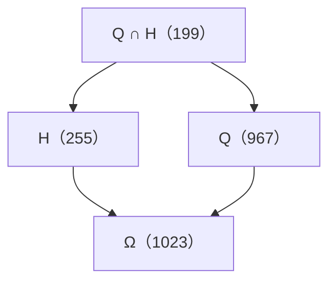

# A/B 的 same-Σ closure 與 weak successor 實驗

2026-09-16。接續 [單邊刪除實驗](c5_disk_deletions.md)，該輪已獨立提交為
`403e2bdbc30276d091ba58257c1bb0b991e7b95e`。本輪只研究其 A=`k3-t175`、
B=`k3-t180`，不擴到 k=4。**以下是有限計算證據與紙面語義說明，未新增 Lean 定理。**

## 1. 結論：這一對落在第三種分支

\[
E(A)=E(B)=\{255,967\}.
\]

不僅根節點的 weak exits 相同：**在 A、B 的全部刪邊子圖聯集中，
同 Σ 確實是一個 weak bisimulation**，採用 §2 明定的操作語義。
兩個根的全部有限 observable traces 相同，全部可達 relation 亦相同。
因此這一對無法提供「忽略 silent deletion 後仍有新 relation 遺漏」的反例。

| 項目 | A | B |
| --- | ---: | ---: |
| 非外圈邊數 | 11 | 11 |
| 全部保留邊子集數 | 2,048 | 2,048 |
| 單邊刪除 transitions | 11,264 | 11,264 |
| silent transitions | 9,728 | 10,220 |
| strict transitions | 1,536 | 1,044 |
| 根的 same-Σ closure 大小 | 64 | 1 |
| 根的 weak exits | `{255,967}` | `{255,967}` |
| 全部可達 Σ | `{199,255,967,1023}` | `{199,255,967,1023}` |

跨兩格共有 3,968 個不同的具名圖（有 128 個共同子圖），逐一核對 240 個 boundary
assignments，共 952,320 次獨立回溯查詢。狀態表計數保留 A/B 來源，所以為 4,096。
每個狀態的 closure、weak exits 與 traces 都有完整計算，並非只測根或深度 2/3。

## 2. 操作語義與 weak bisimulation 的有限判準

固定八個頂點、五條 C5 外圈邊，從各母圖刪去任意非外圈邊，保留全部頂點。
子圖允許低度或孤立內點；嵌入由母圖繼承，不要求子圖仍為 near-triangulation。

- `G →τ H`：刪一條邊且 Σ 相同。
- `G →s H`：刪一條邊且 Σ 嚴格放寬，visible action 的標籤為目標 relation `s=Σ(H)`。
- `G ⇒τ H`：零步或多步 τ。
- `E(G)={Σ(U): G ⇒τ H →s U}`，最後一步必須 strict。

觀察隱藏具體刪邊身分與 silent 步數，不隱藏固定 boundary 的位置。
這裡採 divergence-insensitive weak bisimulation；刪邊嚴格減少邊數，
本身也不可能有無限 τ 路徑。沒有把 ordinary edge-labelled transition equivalence
或刪邊成本等價混入結論。

令 `G ~ H ⇔ Σ(G)=Σ(H)`。在這個對刪邊封閉的有限域內，檢查器驗證：

\[
G\sim H\implies E(G)=E(H).
\]

**紙面推導：** 若 G 走 τ 到 G′，H 可以走零步，仍有 `G′~H`。
若 G strict 到 G′，令 `s=Σ(G′)`，則 `s∈E(G)=E(H)`，
H 可經 `τ*` 再走一次 strict 到 H′，且 `Σ(H′)=s`，故 `G′~H′`。
反向相同。這正給出本語義下的 weak bisimulation 匹配。
這段推導一般成立；「所有同 Σ 狀態 E 相同」只在本輪有限域中驗證。

## 3. 共同機制：兩個限制因子的交集

令 Ω 為全部合法 C5 boundary assignments；定義

\[
Q=\{b\in\Omega:b_0\ne b_3\},\qquad
H=\{b\in\Omega:|\{b_0,b_1,b_2,b_3\}|<4\}.
\]

既有 10-bit key 為 `Q=967`、`H=255`、`Q∩H=199`、`Ω=1023`。
key 僅為證書座標；計算保留完整 boundary relation。

對 A 或 B 的任意保留邊集 M，完整核對得到：

\[
\Sigma(M)=
\begin{cases}Q&03\in M\\\Omega&03\notin M\end{cases}
\quad\cap\quad
\begin{cases}H&D\subseteq M\\\Omega&D\nsubseteq M.\end{cases}
\]

兩張圖的 D 不同：

```text
A: D = {05,15,25,35}
   其餘 {06,07,16,17,56,67} 在 A 的整個刪邊格內不影響 Σ。

B: D = {05,06,07,15,25,26,27,36,57,67}
   除 chord 03 外，全部十條邊都在 D 中。
```

這不只是「刪一條邊的敏感度」猜測；判準對兩張圖的每個 `2^11` 子集均已驗證。
也不聲稱這六條邊在任意後續加邊或其他圖中都無影響。

A 的根 silent closure 恰為任意刪去上述六條無影響邊，所以有 `2^6=64` 個狀態；
按 silent 深度分佈是 `1,6,15,20,15,6,1`。B 沒有根的 silent 刪邊。
但只要 Q、H 都還存在，就可以分別刪 `03` 或 D 中一條邊，放掉其中一項限制；
只剩一項時，也都能再放掉它。共同 weak quotient 因此為：



這個圖省略 silent self-loops。逐狀態結果為：

| Σ | A 中的狀態數 | B 中的狀態數 | 每個該類狀態的 E |
| --- | ---: | ---: | --- |
| 199 | 64 | 1 | `{255,967}` |
| 255 | 64 | 1 | `{1023}` |
| 967 | 960 | 1,023 | `{1023}` |
| 1023 | 960 | 1,023 | 空集 |

## 4. 更深 trace 行為與具體排除範圍

observable trace 是刪邊路徑的 Σ 序列，壓掉相鄰重複，並允許任意有限時刻停止。
兩根的完整 trace 集合均為

```text
(199)
(199,255)
(199,967)
(199,255,1023)
(199,967,1023)
```

因此，在明定的 A/B 刪邊域與觀察語義下，本輪排除：

1. `E(A)≠E(B)` 的反例。
2. 根 weak exits 相同但深度 2/3、乃至任意更深的 observable trace 不同。
3. 同 Σ 的可達子圖因 branch structure 不同而無法 weak-bisimulate；
   核對範圍涵蓋兩格聯集的每個同 Σ 狀態，不只 A 與 B 根。
4. 選 A 或 B 其中一個搜尋全部後代，會漏掉另一根才能得到的 catalogue relation。

**未排除範圍：** 其他 k=3 母圖、先前其餘同 Σ 母圖對、k≥4、任意 C5 cells、
加邊／加點操作、固定刪邊標籤或成本、Kempe／幾何介面行為。
本輪沒有證明「全體 k≤3」甚至「所有 Σ=199 的 k=3 圖」都具此等價性，
也沒有證明一般 completion 或全域安全的 Σ 搜尋商。
先前 87/132 結果仍只是背景 catalogue 比對，不作飽和推論。

## 5. 重現、證書與信任邊界

- [檢查器](../scripts/c5_disk_weak_successors.py)
- [完整證書](../artifacts/c5_disk_weak_successors/observations.json)
- 輸入：[單刪實驗證書](../artifacts/c5_disk_deletions/observations.json) 的上述兩張母圖。

檢查器重建兩張母圖的來源 rotation system 並核對固定邊界 canonical 圖；
所有子圖由刪邊繼承該 drawing。**這次針對兩張具體圖的結果不依賴 plantri
生成完整性的假設**，只使用兩張已驗證的輸入；仍不是 Lean 形式化。

狀態採保留邊 mask，從 `0` 到 `2047` 完整遍歷，不按 Σ 或內點同構剪枝。
Σ 同時比較賦色相容 bitset、逐內部賦色枚舉、240 個 boundary rows 的頂點回溯。
silent closure 用刪邊遞推，並與「同 Σ 的全部 submasks」獨立比對；
這個等價利用刪邊單調性，所有中間圖的 relation 都被相同兩端夾住。
weak exits 同時用遞推與逐 closure 節點的 strict 邊核對；traces 同時用
單邊路徑遞推與 `τ*;strict` 分解核對。所有 mask 的兩因子公式也逐一驗證。

```bash
uv run --with networkx==3.5 python scripts/c5_disk_weak_successors.py --check
lake build
git diff --check
```

`--check` 重新計算並逐 byte 比較保存的證書；輸入與 checker 原始碼 SHA256 均記錄。
本輪重播、文件連結、whitespace 與 `lake build`（8,819 jobs，僅既有 lint）均通過。
本輪停止於這一對 witness 的完整有限行為，不自動擴大搜尋。
下一個有界問題可固定一個 Σ 類，檢查其他母圖是否也具有相同兩因子分解，
或找出不能由它解釋的最小子圖；本輪未啟動。
