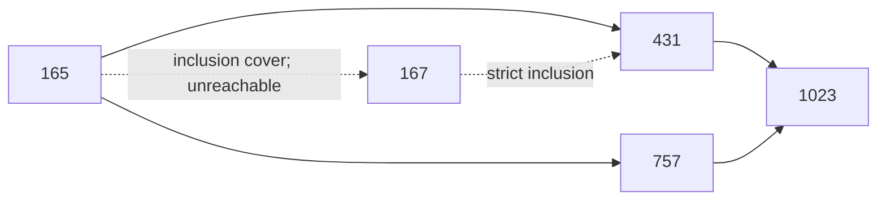

# 87-state weak quotient 與 relation inclusion order

2026-09-16。直接讀取封存的 [weak-deletion audit](c5_weak_deletion_audit.md)
之 `sigma_variants`；**沒有重跑 deletion audit，沒有進入 k=4**。

**W 不是 inclusion Hasse diagram；其傳遞閉包也不是 inclusion order。**
先前「同 Σ 的 W 一致」仍成立，但不能以 inclusion covers 或任意 strict
relation enlargement 取代刪邊行為。本篇不排除其他更豐富的 relation-only 規則，
也不把 87-state 現象提升成一般定理。

後續：[候選定理與反例控制](c5_weak_candidates.md) 找到 T4 upper-cone 的有限子類、
相鄰雙 singleton 完全釋放猜想及兩條出口規律；尚未決定全部 W。

## 1. 域、編碼與完整產物

令 R 是封存 audit 中觀察到的 87 個 Σ，W 由每個 `sigma_variants` 的唯一
variant 取得。所有 inclusion 與中間點量詞都只在 R 中計算。
這裡的「realizable inclusion」指此已觀察集合；若採用
[completion 信任鏈](c5_completion_weak_bisimulation.md)，可作 k≤3 的條件式解讀，
不等於任意 k 的所有 realizable relations。

整數是完整有序 boundary relation 的十個共同 S4 orbit bits，沿用來源的
`pattern_order`，不是 pair projection，也不商掉 D5。

- [分析器](../scripts/c5_weak_quotient.py)：只需 Python standard library。
- [完整 JSON 證書](../artifacts/c5_weak_quotient/observations.json)。
- `nodes`：87 個節點、orbit indices、W、indegree/outdegree、DAG depth、
  到 sink 的最大距離、可達集合、inclusion covers 與來源代表圖完整邊集。
- `edges`、`inclusion_order`、`inclusion_covers`、`transitive_closure`、
  `transitive_reduction`：完整有序邊列表。
- `W_vs_covers`、`TC_vs_inclusion`：全部 extra/missing pairs 及逐項 witness。
- `redundant_edge_witnesses`：每條被 reduction 移除的邊都有最短替代路徑。
- `d5`：十個作用的 pattern/node permutations，以及全部 870 次集合比較。

## 2. 結果

| 項目 | 數量 |
| --- | ---: |
| 節點 | 87 |
| W 邊 | 225 |
| R 中的 strict inclusion pairs | 706 |
| R 的 inclusion covers | 225 |
| W ∩ inclusion covers | 105 |
| W 有、covers 無 | 120 |
| covers 有、W 無 | 120 |
| TC(W) | 266 |
| TC(W) 有、inclusion 無 | 0 |
| inclusion 有、TC(W) 無 | 440 |
| W 的 transitive reduction | 185 |
| W 中有替代路徑的邊 | 40 |
| D5 failures / checks | 0 / 870 |

每條 W 邊均嚴格增加 relation，因此 quotient 是 DAG。Depth 定義為任一 source
到該節點的**最長邊數**；depth 0/1/2/3 分別有 51/30/5/1 個節點。
唯一 sink 是 Ω=1023；最大 depth 為 3。此 depth 不是具體 silent 刪邊步數。

W 本身甚至不是其**自身可達 order** 的 Hasse diagram：例如
`231→1007` 與 `231→999→1007` 同時存在。Transitive reduction 保留可達性，
卻不保留單次 weak exit observable，不能用它替換原 weak quotient。

## 3. 最小 mismatch 與可讀反例

「最小」在此明確限定為 relation witness：以
`(|σ|bits, |τ|bits, σ整數, τ整數)` 排序；中間點以 `(popcount, 整數)` 排序。
非 cover 的最小大小證據是三點鏈；缺邊是兩點加完整 W 集合。
每個不可達 pair 保存來源的最小 forward-closed 集合，含來源本身，
目標不在其中。路徑以 BFS 取最短，數值排序破除平手。
來源代表圖沿用封存證書，**不宣稱對全部 mismatch 做了圖大小最小化**。

三種非空 mismatch 類別的排序最小 witness 共用：

\[
165\subsetneq167\subsetneq431,\qquad
W(165)=\{431,757\},\qquad
TC(W)(165)=\{431,757,1023\}.
\]

具體 bits 為 `165={0,2,5,7}`、`167={0,1,2,5,7}`、
`431={0,1,2,3,5,7,8}`。
所以 `165→431` 是跳過 realizable 中間點的 weak edge；
`165⊊167` 只差一 bit，必為 inclusion cover，卻不是 weak edge，也不可達。
不可達 cut 為 `{165,431,757,1023}`，對 W 封閉。



165 的來源代表為 `k0-t4, mask=3`：C5 加 chords `{1,4}`、`{2,4}`。
刪去 `{1,4}` 得 431；刪去 `{2,4}` 得 757；再刪剩餘 chord 得 Ω。
兩個第一步都 strict，因此沒有其他 silent 出口。
167 的來源代表為 `k2-t59, mask=255`，七個頂點，其非外圈邊是
`{0,5},{0,6},{1,5},{2,4},{2,5},{2,6},{4,6},{5,6}`。
這說明 relation 包含可連接不同 realization 的限制強弱，並不保證存在刪邊路徑。
最小反例涉及的 165、167、431 代表另以全部 240 個 ordered boundary rows
與內點賦色直接核對；沒有展開其母圖 deletion lattices。

## 4. D5 audit 與候選命題邊界

採 pullback `p'[i]=p[(-1)^s(i+a) mod 5]`，與既有 enumerator 相同。
每次位置作用後只做共同顏色 normalization。驗證十個 pattern permutations、
R 的封閉性、全部 ordered rows 與 bit encoding 的作用一致性，以及
每個 `d,σ` 的 `W(dσ)=dW(σ)`；870 次比較全部通過。

一般的 D5 equivariance 有直接 relabelling 理由：位置置換將具體圖、
silent paths 與 strict exits 雙射到重新標號後的對象，逆置換給反向包含。
它與「同 relation 的不同 realization 有相同 W」是不同命題；本輪沒有新增 Lean 證明。

本輪沒有得到新的簡單 order 公式可整理成肯定候選定理。
「W 是 realizable inclusion covers」與「TC(W) 是 realizable inclusion」
已被明確反例否定。來源的 weak deletion congruence conjecture 仍可保留：
**一般 ordered-C5 disk deletion 系統中，相同 Σ 是否總有相同 W？**
87-state audit 支持它，但本次失敗的 order 公式沒有提供一般結構證明。

## 5. 重現與信任邊界

```bash
python scripts/c5_weak_quotient.py --check
lake build
git diff --check
```

分析器綁定封存證書 SHA-256，並核對來源證書記錄的輸入及程式 hashes；
不重新執行其全量 audit。BFS closure 與獨立 Floyd–Warshall 相等；
reduction 重建相同 closure，且每條保留邊沒有中間可達點。
全部 mismatch 保存在 JSON，並非只列抽樣。
`--check` 重新計算此次小 quotient 分析並逐 byte 比對產物。
結果依賴既有 Python 證書、其有限域與編碼；沒有新增 Lean theorem 或一般實現性結論。

驗證通過：此次 `--check` 逐 byte 一致、`lake build`（8,820 jobs，僅既有 lint）、
本次文件連結與 whitespace 檢查。

停止點：完成 87-state order 與 D5 分析；未跑 k=4，未重跑舊 deletion audit。
