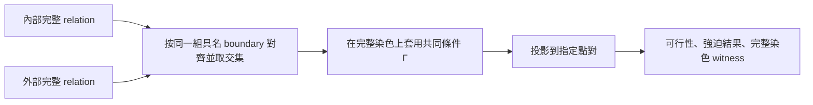

# 完整 boundary relation 與同一 C5 上的條件 pair forcing

2026-09-12。使用者指定：先建立 generic boundary relation；本輪只實作／驗證
**同一個有序 C5** 上的 pair forcing。Pairwise relation 必須由完整 relation 投影，
不得反向以 pair constraints 代表完整狀態。不實作兩個 C5 的串接或一般 transducer。

## 主狀態與查詢語意

對具名 boundary `B`，主狀態是完整關係

\[
R\subseteq\{0,1,2,3\}^{B}.
\]

給共同條件 Γ 與點對 `(i,j)`，**先**套用 Γ，再投影：

\[
P_{ij}^{\Gamma}(R)=\{(b_i,b_j):b\in R,\ \Gamma(b)\}.
\]

| 投影結果 | 查詢答案 |
| --- | --- |
| 空 | `infeasible`：共同條件無解 |
| 非空，全部相等 | `forced_equal` |
| 非空，全部不同 | `forced_different` |
| 相等／不同皆可 | `free` |

`free` 只表示這個 pair 的兩種情況都能發生，不表示它與其他 pair 獨立。
查詢同時回傳 full boundary colouring witness；不只回傳 pair 的布林狀態。
空關係不得藉 vacuous truth 回報強迫同色或異色。



內外部除了 boundary 之外的變數必須獨立，交集才是正確的圖合成語意。
若還共享內部點或 frame，應先保留共享變數；本輪不提供這類串接操作。
幾何不是這個流程的輸出。每個庫 entry 另指向實際 disk witness；一般 `meet` 不宣稱
兩塊可同側放置。指定一內一外的展示例另查實際 union graph。

## 色名壓縮與 boundary 對齊

Lean 的 `BoundaryRel k` 保留所有完整 `BoundaryAssignment k`。
Python 的 generic `Relation(ports, patterns)` 每列表示一個**全域 S4 orbit**，
適用於對全域換色封閉的關係；它不表示有絕對預染色色名的任意關係。
本輪所有 graph Σ 與 EQ/NEQ guards 都滿足這個前提。

C5 上所有合法四選色 assignment 有 240 個，壓成十列 complete patterns。
固定 `b0..b4`；不做 D5 quotient，也不各自重新命名兩側 boundary 頂點。
`reorder` 只改儲存順序；`rename` 是顯式改接線，可能改變實際 relation。

五條鄰邊原本就是 NEQ；五條對角點對才是額外 EQ/NEQ 變數。
在四選色 proper C5 中，每個 pattern 的同色對集合是 pentagram 上大小 1 或 2 的
matching；十個完整 pattern 分別為五個單邊及五個雙邊 matching。
這是五點情況的直接染色分類；不得把「允許哪些完整 matching」降成每條邊各自能否出現。

## 已封裝的庫

來源是 [內部五邊形研究](fan_pentagon.md) 的 87 個 exact Σ，包含全部原 K3 的 42 個。

* 主資料：`artifacts/boundary_relations/library.json`，每個 entry 保存完整 patterns。
* 派生資料：所有十個 pair 的無條件投影與 witness；750 條 entry-specific 最小條件強迫。
* 最小條件：遍歷五條對角 pair 的 `無條件 / EQ / NEQ` 共 `3^5=243` 種 conjunction；
  排除無解 antecedent、排除只靠原 C5 即成立的規則，刪除可再去掉 premise 的推論。
  750 是各 entry 的規則數加總，不宣稱 750 條全互異規則。
* EQ/NEQ 查詢允許任意多個共同條件，先在完整 relation 上篩選。
* 同一 boundary 的 `meet`、顯式對齊、pair 投影可由 Python API 使用。
* 沒有「從 pair marginals 重建 relation」API；完整 relation 永遠是權威資料。

```bash
# 重建 catalog；先完成 fan_pentagon 的獨立 replay
uv run --with networkx==3.5 python scripts/c5_relation_library.py build

# 新例子，查所有 pairs 在共同條件下的結果
python scripts/c5_relation_library.py query 767 --given 'b1=b4' --given 'b0!=b2'

# 兩側對齊完整 relation，再求 pair forcing
python scripts/c5_relation_library.py meet 91 935

# 無解條件回報 infeasible
python scripts/c5_relation_library.py query 767 --given 'b0=b1'

uv run --with networkx==3.5 python scripts/check_c5_relation_library.py
```

ID 是 `pattern_order` 下的十-bit Σ 整數，不是圖同構編號。某個 Σ 可以有很多圖實現，
entry 的 witness 不能代表所有未來的幾何接線可行性。

## 兩個研究例子

### 所有單對投影相同，條件強迫卻不同

`R767` 是新五邊形 witness 的 exact Σ；`R1023` 是全體 proper C5。
它們每個 pair 的投影完全相同：鄰邊永遠異色，對角 pair 同色／異色皆可。
但在共同條件 `b1=b4 AND b0!=b2` 下：

| 主狀態 | b0 與 b3 | witness |
| --- | --- | --- |
| R767 | 強迫相等 | 01201 |
| R1023 | 相等／不同皆可 | 01201 / 01231 |

所以即使保存所有單對投影，也無法恢復這個條件行為。
`Math/C5PairForcing.lean` 證明實際完整 labeled sets 的 pair projections 相同、
full relations 不同，且上述 forcing 不同。這些具體有限檢查使用 `native_decide`。

### 內外兩側合用才強迫同色

`R91` 與 `R935` 各自對 `(b0,b2)` 都允許同色／異色；對齊後：

\[
R_{91}\cap R_{935}=\{01012,01021\}/\text{global colour renaming},
\]

即 48 個完整 labeled assignments，全部 `b0=b2`。
`artifacts/boundary_relations/inside_outside.json` 保存兩個真實 fan witnesses
與它們的 union graph（boundary 共用、interiors 分開），並附 planar rotation。
獨立 checker 直接在 union graph 上 backtrack 全部 240 個 boundary assignments，
確認恰上述 48 個可延伸，不只重算十-bit 交集。

**Computationally observed：** union graph planar，但指定 C5 不 cofacial；
這兩個選定 witnesses 可以對應一內一外，不能全塞到 C5 同一側。
這是具體實現的幾何結果，不是所有同 Σ witnesses 的不可同側定理。

## 驗證與界線

**Proved in Lean，普通證明：** `Math/BoundaryRelations.lean` 泛型完整關係、
投影 membership、非空 forcing 的語意、conditional forcing 的完整染色語意、
空關係不強迫、conditioning 與 intersection 相容；另證

\[
\pi_{ij}(R\cap S)\subseteq\pi_{ij}(R)\cap\pi_{ij}(S).
\]

只有包含方向，不能用右側代替左側。這正是要先交集完整 states、再投影的原因。

**Proved in Lean，native finite checks：** `Math/C5PairForcing.lean` 的上述
R767 / R1023 反例；R767 與實際圖的 exact Σ 經 `Math/FanPentagon.lean` 相連。

**Computationally observed / independently replayed：** 全庫 87 個 relations ×
243 組對角 conjunction × 10 pairs = 211,410 個查詢，與完整 240-coloring 語意比較；
另外檢查鄰邊 EQ 無解、NEQ 冗餘、750 條最小規則、3,828 個對齊交集、具名重排、
所有 pair projections，以及 inside/outside union graph 的實際染色和 rotation。
這不是 87 個 states 或 750 條規則全數 Lean 化。

本輪完整 `lake build` 通過（8800 jobs）；新模組無 warning，保留既有 AttachmentOrder
warnings。`Math/FanPentagonAudit.lean` 審計結果在
`artifacts/fan_pentagon/lean-audit.txt`，無 `sorryAx`；普通定理與 native finite checks
分開列出。`artifacts/boundary_relations/replay.json` 保存獨立重驗結果及來源 hash。
搜尋核心輸出與 catalog 的決定性重建逐 byte 一致。

**未實作／未驗證：** 兩個不同 C5 接口、跨接口串接、一般 k 的枚舉分類、
幾何 composition completeness、從 pair constraints 重建 full relation。

下一步研究應以完整 relation 的差異和可讀 conditional clauses 為主，
再研究哪些條件可由同側或異側的真實 patches 同時實現。
