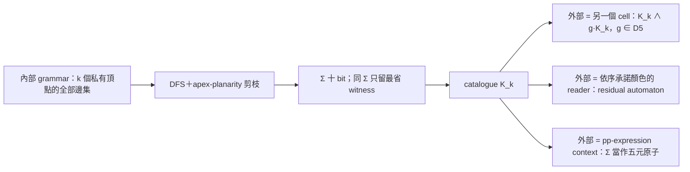

# C5 cell 窮舉器：C5 邊界＋密封內部＋只把邊界限制往外暴露

2026-09-13。使用者提問：C5 能不能當子結構——

$$
\boxed{\text{C5 boundary}+\text{內部結構}+\text{外部 attachments}}
$$

只把「內部對 C5 邊界造成的限制」暴露給外部，並為這個分解設計窮舉器。
本文件是設計說明加第一輪 $k\le5$ 的精確枚舉、以及用 reduction 跳過 $k=6,7$ 的觀察；程式為
`scripts/c5_cell_enumerator.py`（精確）與 `scripts/c5_cell_reduced.py`（reduction 版），
產物在 `artifacts/c5_cells/`。所有數字都是 **computationally observed**。
R1（低度內點刪除保 $\Sigma$）已在 `Math/LocalClosure.lean` 證明；catalogue 計數本身沒有 Lean 證書。
**§0 先給出 `bits` 的完整規格與「production 輸出 ≡ 規格」的獨立 checker（computationally verified，非 Lean）。**

## 0. 十 bit mask 的規格（specification）與 bridge 驗證

本節是 `cells.json` 裡 `bits` 這個數字的完整規格，以及「production 輸出 ≡ 規格」的獨立驗證。
被驗物件：`scripts/c5_cell_enumerator.py`；checker：`scripts/c5_sigma_bridge.py`；
報告：`artifacts/c5_cells/sigma_bridge.json`。信任層級：**computationally verified（有限域，清單見 §0.4）；
不是 Lean 證明，也不是對所有 $k$ 的定理**。本節只做表示／語意對齊，沒有新增數學搜尋結果，
也沒有更動任何 catalogue 數字（見 §0.5）。

### 0.1 cell graph 與 mask 的座標系

固定 $k\ge0$，內部私有頂點 $X=\{5,\dots,4+k\}$，邊宇宙

\[
U(k)=\underbrace{\{(0,2),(0,3),(1,3),(1,4),(2,4)\}}_{5\ \text{chords}}
\ \cup\ \underbrace{\{(i,5+m):0\le i<5,\ 0\le m<k\}}_{5k\ \text{boundary–interior}}
\ \cup\ \underbrace{\{(5+m,5+l):0\le m<l<k\}}_{\binom k2\ \text{interior–interior}}
\]

以固定 list 順序排（chords → 依 $m$ 再依 $i$ 的 attachments → 字典序 interior pairs），第 $j$ 條邊就是 bit $j$
（little-endian）。一個 mask $M$ 就是 $U(k)$ 的一個子集；**邊界 C5 $0$-$1$-$2$-$3$-$4$-$0$ 永遠存在、不佔 bit**。
`cells.json` 的 `edge_universe` 就是這份順序，`k_eff` 是 witness 實際用到的內部頂點數
（孤立內點不佔 bit，所以同一個 mask 可以對多個 $k$）。

### 0.2 一個 bit 的精確語義

$\mathrm{proper}(C_5)$ 是邊界五邊形的正常四色著色（240 個）。$S_4$ 是**全域**換色（boundary 與 interior 同時置換）。
$[b]$ 是 $b$ 的 $S_4$ orbit，代表元取字典序最小者——等價於 `boundary_relations.normalize` 的首次出現正規化。

`PATTERN_ORDER`（= `cells.json` 的 `pattern_order` = production `REPS` = 兩個 library 的同一順序）：

\[
[0,1,0,1,2]\ [0,1,0,2,1]\ [0,1,0,2,3]\ [0,1,2,0,1]\ [0,1,2,0,2]\ [0,1,2,0,3]\ [0,1,2,1,2]\ [0,1,2,1,3]\ [0,1,2,3,1]\ [0,1,2,3,2]
\]

\[
\Sigma(k,M)=\bigl\{\,[b]:\ b\in\mathrm{proper}(C_5),\ \exists x:X\to\{0,1,2,3\},\
\mathrm{proper}_{\,C_5\cup M}(b,x)\,\bigr\}
\]

\[
\mathrm{bit}_j(k,M)=1\iff \texttt{PATTERN\_ORDER}[j]\in\Sigma(k,M),
\qquad
\texttt{bits}(k,M)=\sum_{j=0}^{9}\mathrm{bit}_j(k,M)\,2^j
\]

**bit=1 的完整讀法**：這個邊界顏色類**至少有一個**合法內部延伸（含 chords、attachments、interior 邊）。
bit=0 是「一個都沒有」。它不是「所有延伸都長這樣」，也不是「外部一定配合得了」——
外部那半是另一層（§1 的 $R_A$、§2b 的 condition／residual）。
可行性對 orbit 良定義：若 $x$ 是 $b$ 的延伸，則 $\sigma\circ x$ 是 $\sigma\circ b$ 的延伸；
所以「用代表元測可行性」與「orbit 內任一元素可延伸」等價（§0.4 對每個 $k$ 抽 200 個接受節點實測）。

### 0.3 canonicalization：S4 進 key，D5 不進

| 作用 | 何時作用 | 實作 |
| --- | --- | --- |
| $S_4$ 全域換色 | **進** catalogue key：每個 bit 只記一個 orbit | `boundary_relations.normalize`（首次出現正規化） |
| $D_5$ 邊界重標 | **不進** key；只在外部對齊兩側標號時用 | `D5` pattern-index 置換表、`act_mask` |

因此 `bits` 是**帶標號**的 key（$b_0,\dots,b_4$ 固定，與既有 library 慣例相同）；
$k\le5$ 的 132 個 Σ 是 24 個 $D_5$ orbits，$D_5$ 商不改變 catalogue，也不改變任何一個 bit。

### 0.4 production 對照與 bridge 結果

| 規格 | production 實作 | 位置 |
| --- | --- | --- |
| $U(k)$ 的邊順序 | `edge_universe(k)` | `c5_cell_enumerator.py` L66–70 |
| `PATTERN_ORDER` | `REPS`（全部 proper C5 pattern 的 S4 代表元，排序；`assert len == 10`） | L38–40 |
| $[b]$ | `boundary_relations.normalize` | `boundary_relations.py` L12–14 |
| $\exists x$ 正常延伸 | `compat_tables`：每條邊對每個 pattern 的 $4^k$ 相容賦色 bitset；DFS 路徑上依序 AND | L73–88、L149 |
| $\mathrm{bit}_j$ = bitset 非空 | `bits = sum(1 << j for j, s in enumerate(surviving) if s)` | L125（`_record`） |
| graph 的邊集 | DFS 路徑 mask（`mask \| 1 << e`） | L139–153 |
| $\Sigma$ | `per_sigma` 的 key | L128 |

checker 用**兩條獨立路線**對撞：

* **reference（只用手寫定義）**：`ref_bits` 先枚舉 240 個 boundary colouring、再對 interior 做約束回溯；
  `ref_bitwise` 對十個 orbit 代表元各自獨立測可行性；`ref_bits_product` 暴力跑完 $4^{5+k}$ 個賦色。
  `PATTERN_ORDER` 與 $[b]$ 也在 checker 內用不同演算法重新推導（`orbit_rep` = 24 個置換取最小），
  再與 production `REPS`、`cells.json`、`boundary_relations/library.json`、`fan_pentagon/states.json` 的順序比對。
* **production**：`compat_tables` 的值域 + production `_record` 的 bit 編碼；DFS 模式更直接跑 production 的
  `enumerate_cells`，用 spy 掛在 `_record` 上，逐個接受節點取 mask——**連 AND 摺疊都是 production 自己的程式**。

指令與覆蓋（`--product` 額外用 $4^{5+k}$ 全枚舉交叉檢查 reference 自己）：

```bash
uv run --with networkx==3.5 --with rustworkx==0.17.1 python scripts/c5_sigma_bridge.py \
  --cases --product --catalogue --random 60 \
  --all-masks 0 --all-masks 1 --all-masks 2 --all-masks 3 --dfs 2 --dfs 3 --dfs 4
```

| 域 | 覆蓋 | 結果 |
| --- | --- | --- |
| $k\le3$ 全部 graph | $U(k)$ 的**每一個**邊子集（32／1,024／65,536／8,388,608 個，含非平面者） | 0 mismatch |
| $k=2$ DFS 接受節點 | 6,606／6,606（exhaustive，distinct Σ = 52 = $\lvert K_2\rvert$） | 0 mismatch |
| $k=3$ DFS 接受節點 | 312,067／312,067（exhaustive，distinct Σ = 87 = $\lvert K_3\rvert$） | 0 mismatch |
| $k=4$ DFS 接受節點 | 20,904,415／20,904,415（exhaustive，distinct Σ = 112 = $\lvert K_4\rvert$） | 0 mismatch |
| $k\le5$ catalogue | 132／132 個 witness（含空內部、chords-only、$k_{\mathrm{eff}}=1..5$），另重驗 apex-planarity | 0 mismatch |
| 手工極端 case | 20 個（$K_5$ 邊界、$K_4$ 邊界、空內部、孤立內點、內點 $K_4$／$K_5$、五點全 attach…） | 0 mismatch |
| 隨機 graph | 60 個（$k\le3$），reference 另與 $4^{5+k}$ 全枚舉對照 | 0 mismatch |

DFS 模式另對每個 $k$ 的前 200 個接受節點加驗 S4 orbit 不變性（orbit 內 24 個成員可行性一致）與
orbit-union 版 $\Sigma$，同樣 0 失敗；所有節點都是 `prod_bits` 與 `ref_bitwise` 的十個 bit 逐一相等。
整輪約 21 分鐘（$k=4$ 的 2,090 萬節點約 16 分鐘、$k\le3$ 全宇宙約 4 分鐘），exit code 0。

### 0.5 這條 bridge 的信任層級與界線

信任鏈（每一段都有對應的檢查，不是只有頭尾比對）：

$$
\text{graph}
\xrightarrow{\ \texttt{ref\_feasible}\ }
\text{boundary colouring feasibility}
\xrightarrow{\ \text{十個 orbit bit}\ }
\Sigma
\xrightarrow{\ \texttt{PATTERN\_ORDER}\ }
\text{10-bit encoding}
\xrightarrow{\ \texttt{prod\_bits}\,/\,\text{DFS spy}\ }
\text{enumerator output}
$$

* 這是 **executable checked／computationally verified**：有限域上的逐 bit 相等，**不是 Lean 定理**。
  Lean 裡只有一般性的 $\operatorname{Summary}$／$\Sigma$ 語義（`Math/Boundary.lean`、`Math/LocalClosure.lean`），
  **沒有**對應「十 bit 編碼」或 DFS 的 Lean 物件；本次沒有新增任何 Lean。
* $k\le3$ 是**全宇宙**（所有邊子集）；$k=4$ **只涵蓋 enumerator 接受的 20,904,415 個節點**（不是 $2^{31}$ 全宇宙）；
  $k=5$ 只涵蓋 catalogue witness 與手工 case，**不是** $2^{40}$ 全宇宙。$k\ge6$ 沒有精確枚舉，未驗。
* 幾何不在這條鏈上：apex-planarity 決定誰進 catalogue，不決定 $\Sigma$。checker 對 catalogue 重驗了
  disk 條件（NetworkX planarity），但「mask ≡ Σ」與 planarity 無關。
* 沒有驗到：SYM（內部標號正規化）、R1／R2 的實作、reduced $k=6,7$ 搜尋、$K_6=K_5$、$K_\infty=K_5$、
  D5 對齊下的 `Σ_in & g·Σ_out` 語義（只驗了 pattern 順序在四個檔案一致）。
  本文件其他地方對這些的保留不變。
* catalogue 數字沒有變：不重跑 enumerator、不改 `cells.json`；checker 反向從 witness 邊集重算 Σ，
  得到同一組 132 個 key 與同一組 nested 計數（11／22／52／87／112／132），
  並記錄 `cells.json` 的 sha256。

## 1. 答案：可以，條件是「密封」與「C5 在內側是 face」

把一個 **cell** 定義為

\[
\mathcal C=(B,\,I,\,A),\qquad B=(b_0,\dots,b_4)\text{ 有序 C5},\quad
I\text{ 內部圖（私有頂點 }X\text{、含畫在內側的 chords）},\quad
A\text{ 外部 attachments}.
\]

暴露給外部的唯一資料是

\[
\Sigma(I)=\{\,b\in\mathrm{proper}(C_5):\ \exists x:X\to\mathrm{Color},\ \mathrm{Proper}_{C_5+I}(b,x)\,\}
\]

依既有慣例壓成十個 S4-orbit bits（`pattern_order` 與 `boundary_relations` 相同）。

它是無損的，靠兩件事：

| 層 | 敘述 | 信任 |
| --- | --- | --- |
| 染色 | $R_{I\cup_B A}(b)\iff\Sigma(I)(b)\wedge R_A(b)$；內部變數 $x$ 未來不再被讀取時可存在量化 | proved in Lean：`summary_glue`、`seal_future`（[local_closure.md](local_closure.md) §1） |
| 幾何 | $I$、$A$ 各自是以 $C_5$ 為 face 的 disk patch 時，沿 $C_5$ 黏合永遠是平面圖，外部不需要知道內部畫法 | 標準組合拓撲（兩個 disk 沿邊界黏成球面），未 Lean 化，與既有 topology 信任範圍相同 |

所以「C5 能當子結構」的精確條件是：

1. **密封**：$X$ 不再接任何未來的邊、預染色或共享 frame。若內部還要施工，$x$ 仍是介面的一部分，不能只留 Σ。
2. **C5 是內側的 face**（apex-planarity 通過）。HANDOFF 記錄過的 11 頂點 BAD 圖裡 C5 是 separating cycle 但兩側非 disk 對齊時，同 Σ 的兩個 witness 有不同的 disk context 合法性；那種情況不是 cell，Σ 對幾何不無損。

在這兩個條件下，外部只看到「一個五端 hyper-constraint、內容是十個 bit」；
不同內部若 Σ 相同，對所有外部 context 都不可分辨（`replacement`）。

## 2. 窮舉器的分解

窮舉器不對「內部 × 外部」做乘積搜尋，而是分成三層，中間只以 Σ 相接：



### 2a. 內部窮舉（inner）

* **邊宇宙**：5 條 chords（畫在內側）、$5k$ 條 boundary–interior、$\binom k2$ 條 interior–interior；
  $|E|=5+5k+\binom k2$。
* **搜尋**：與 `fan_pentagon.py` 相同的遞增 bit DFS；加邊後對「圖＋接全部五個 boundary 的 apex」做
  Left–Right planarity；nonplanar 前綴的所有高位 supersets 一次剪掉。程式 assert 接受區間與拒絕前綴
  區間恰好鋪滿 $2^{|E|}$。
* **Σ 計算**：每條邊對每個 pattern 預先算「相容的 $4^k$ 內部賦色」bitset；沿 DFS 取 AND，
  Σ 的第 $j$ bit 就是第 $j$ 個 pattern 的 bitset 非空。chord $b_ib_j$ 對 $b_i=b_j$ 的 pattern 給 0。
* **去重**：只以 Σ 為 key。每個 Σ 記錄 labeled masks 數、內部重標下 canonical masks 數、
  最省 witness（先比實際用到的內部頂點數 $k_{\mathrm{eff}}$，再比邊數）。因為 $k_{\mathrm{eff}}$
  可小於 $k$，一次 $k$ 的搜尋直接給出 nested catalogue $K_0\subseteq K_1\subseteq\cdots\subseteq K_k$。
* **不做 D5 商**：catalogue 的 key 固定 $b_0..b_4$ 標號，與既有 library 相同；D5 只在外部對齊時使用。
* **平行**：`--jobs` 由父程序走前 12 個 edge bit，每個接受的前綴節點是一個子樹任務（848 個）；
  各任務的 accepted／rejected／coverage 分開累加，最後仍 assert 鋪滿 $2^{|E|}$。
  jobs=1 與 jobs=16 逐 cell 相同。

| $k$ | $|E|$ | $2^{|E|}$ | planarity calls | 秒 |
| ---: | ---: | ---: | ---: | ---: |
| 2 | 16 | 65,536 | 9,395 | 0.0 |
| 3 | 23 | 8,388,608 | 457,305 | 2.7（1 core） |
| 4 | 31 | 2,147,483,648 | 32,892,911 | 163（1 core）／13.7（16 cores） |
| 5 | 40 | 1,099,511,627,776 | 3,220,467,449 | 1,036（30 workers） |

### 2b. 暴露介面（exposure）

| 操作 | 意義 | 實作 |
| --- | --- | --- |
| `Σ(cell)` | 十 bit | inner 輸出 |
| `g·Σ`，$g\in D_5$ | 外部用另一種邊界標號時的對齊 | pattern index 置換表 `D5` |
| `Σ_in & g·Σ_out` | 兩側同時存在（`join`） | bit AND，語意由 `summary_glue` 保證 |
| `condition(Σ, Γ)` | 已承諾的 boundary 顏色／EQ-NEQ 條件 | pattern 篩選（既有 `Relation.condition`） |
| residual automaton | 外部依 $b_0,b_1,\dots$ 順序承諾顏色時 cell 剩下的狀態 | 對每個長度 $n$ 的 normalised prefix 取殘餘 mask |
| dead prefix | 某個本身可延伸成 proper C5 的前綴，殘餘為空 | cell 對承諾式外部的「局部 trap」 |
| nest | cell 裡面再有 cell | 外層內部是 annulus（十個 port），走 [pp 層](pp_relations.md)：$R_{\text{outer}}(b)=\exists c\,[R_{\text{ann}}(b,c)\wedge\Sigma_{\text{inner}}(c)]$ |

### 2c. 外部（outer）三種模式

1. **外部也是 cell**：separating C5 的可實現 Σ 集合就是 $\{\Sigma_1\wedge g\Sigma_2\}$；BAD、exact $T_4$
   都在這裡直接讀出，不必再枚舉 union graph。
2. **外部是承諾顏色的 reader**（strip／stepwise 模型）：cell 是一個帶十 bit 表的節點，
   每承諾一個 boundary 顏色就 `condition` 一次；它對外部狀態機的貢獻是有限個殘餘 mask。
3. **外部是 pp-expression**：Σ 當作五元原子 `R{bits}`，沿用既有求值器。

## 3. 第一輪觀察（精確枚舉 $k\le5$）

（`--k 3`、`--k 4`、`--k 5` 各跑一次；低層數字每次一致。）

| $k_{\mathrm{eff}}$ | 0 | 1 | 2 | 3 | 4 | 5 |
| --- | ---: | ---: | ---: | ---: | ---: | ---: |
| $|K_{k}|$（distinct Σ） | 11 | 22 | 52 | 87 | 112 | 132 |
| 新增 | 11 | 11 | 30 | 35 | 25 | 20 |

（本節全部是精確枚舉輸出。$K_6$、$K_7$ 見 §7，是**條件式**結論，前提寫在 §7.0。）

**與既有 library 的關係。** 原 K3 grammar 的 42 個 Σ 全部在 $K_3$；內部五邊形 grammar 的 87 個 Σ
有 52 個在 $K_3$、77 個在 $K_4$、全部 87 個在 $K_5$。$K_3$ 也恰好 87 個，是巧合，集合不同。

**三色 profile。** 既有兩個 grammar 都禁 chords，觀察到「至少接受兩個三色 pattern，且恰兩個時相鄰」。
允許 chords 後這兩條都不成立：

* $k_{\mathrm{eff}}=0$、兩條同端 chords（例如 `[0,2],[0,3]`，Σ=960）恰接受一個三色 pattern——
  singleton 在 chord 的公共端點。五個這樣的 cell 就是五個 profile-1 狀態。
* $k_{\mathrm{eff}}=3$ 起出現 profile 為兩個不相鄰 singleton 的 cell（Σ=429：profile $\{2,4\}$）。
* 沒有 Σ 為空或不含三色 pattern 的 cell（與 apex 論證一致：cell＋apex 是平面圖，4CT 給三色邊界；
  這裡只是 $k\le4$ 的有限驗證）。

**Separating C5（cell ∧ D5-對齊的 cell）。** $k\le3$：798 個不同 meet、沒有空 meet、31 個 BAD meet、
exact $T_4$ 有 200 組對齊配對。最便宜的 BAD 是 $0+0$ 個內部頂點：一側 chord `[0,2]`（Σ=1016）、
另一側 chords `[0,3],[1,3]`（Σ=774），union 是 boundary 上的 $K_4$；這正是 HANDOFF 記錄的最小
$(5,8)$ BAD。exact $T_4$ 需要 $3+3$，與先前 11 頂點結果一致。$k\le4$ 的 meet 增到 938 種，但 BAD meet 仍是 31 個、exact $T_4$ 仍是 200 組：第四個內部頂點沒有新的 BAD 組合。$k\le5$：meet 達到全部 1,023 個非空 mask
（任何非空 Σ 都是兩個 cell 的 D5 對齊交集），BAD meet 與 exact $T_4$ 仍是 31／200。

**Residual automaton。** $k\le3$：所有 cell 所有前綴的殘餘 mask 只有 142 種；除 Σ=1023（空內部）外
每個 cell 都有 dead prefix；最早的 dead prefix 長度 3（例如 chord `[0,2]` 的 cell 在 $b_0=b_2$ 承諾後
即死）。$k\le4$：171 種殘餘 mask、112 個 cell 中 111 個有 dead prefix、最早仍是長度 3；$k\le5$：193 種、131／132。
這是 cell 放進承諾式外部時需要攜帶的全部狀態：有限、且遠小於 $2^{10}$。

## 4. 對 stepwise／strip 模型的意義

* 在 [§9k](stepwise_state_sufficiency.md) 的 committed-colour strip 裡，trap 是「forced cone 中已註定的碰撞」。
  cell 的 dead prefix 是同一類現象的最小版本：boundary 顏色一個個承諾，內部（已密封、不再有自由）
  在某個前綴後無法完成。差別是 strip 的內部不是密封的（後續 layer 還會接進來），所以那裡不能只留 Σ。
* 若在 strip 裡指定一個 5-cycle，其內側**不再施工**，就可以把該側換成 cell；外部狀態機只多帶一個殘餘 mask。
  這是把 §9k 的 trap 判準模組化的一條路：先把「會死的子結構」封成 cell，再由 outer reader 判斷。
* 尚未做：從 strip grammar 自動抽出可密封的 5-cycles；strip 的 fan 結構通常讓 C5 帶 chords，
  需要先確認內側確實是 disk。

## 5. 界線與後續

* 精確枚舉止於 $k=5$（$2^{40}$）；$k=6,7$ **跑不動**，只有 §7 的 reduction 版，其「新 Σ 完整」是
  條件式（§7.0：R1 已 Lean 化；仍依賴 SYM＋程式正確，只在 $k\le5$ 經驗驗證），labeled 計數在那個模式下也**不是**全宇宙計數。
  $k\ge8$ 需要把 R2 變成生成階段的剪枝，或改走 near-triangulation → 邊子集；未實作。
* R1（低度內點刪除保 $\Sigma$）已有 Lean 證書；catalogue 本身與 $k=6,7$ reduced 搜尋沒有 Lean 證書。`--check` 以 NetworkX planarity 與全染色 brute force 獨立重驗每個 witness 的 Σ 與 disk 性質；§0 的 `c5_sigma_bridge.py` 另外把「十 bit mask ≡ Σ」逐 bit 對齊（$k\le3$ 全宇宙、$k=4$ 全部接受節點、$k\le5$ 全部 witness）。
* catalogue key 未取 D5 商（$k\le5$ 的 132 個 Σ 是 24 個 D5 orbits），與既有 library 慣例一致。
* nested cell 的 annulus relation（十個 port）尚未枚舉；pp 求值器有十個變數的上限，剛好夠一層。
* 內部非密封、或 C5 在內側非 face，都不是 cell；不得把 Σ 當成那些情況的充分狀態。

## 7. 用 $k\le5$ 找 reduction，跳過 $k=6,7$

問題：精確枚舉在 $k=5$ 花 17 分鐘（$2^{40}$），$k=6$ 是 $2^{50}\approx1.1\times10^{15}$，
$k=7$ 是 $2^{60}$——**精確枚舉在 $k\ge6$ 是跑不動的**，不是慢，是不可行。
目標只是 Σ 的 catalogue，所以可以丟掉「Σ 已在 $K_{k-1}$」的圖。從 $k\le5$ 的資料抽出三條規則
（`scripts/c5_cell_reduced.py`）：

### 7.0 前提：$K_6=K_5$、$K_7=K_5$ 是**條件式**結論

**$k\ge6$ 沒有任何精確枚舉結果。** 下面的 $k=6,7$ 數字全部來自 reduced 搜尋，其正確性依賴三件事：

| # | 前提 | 狀態 |
| --- | --- | --- |
| 1 | **R1 引理**：內部頂點 $v$ 若 $\deg(v)\le3$，則 $\Sigma(G)=\Sigma(G-v)$ | **proved in Lean**：`summary_eq_deletePrivate`（一般 boundary）、`sigma_eq_delete_private`（C5 形式）；只對「內點」用，boundary 固定不動 |
| 2 | **SYM 只是標號正規化**：$\Sigma$ 與內部標號無關，按 attachment mask 排序後每個 unlabeled 圖至少留一個代表 | 組合事實，未 Lean 化 |
| 3 | **程式正確實作 1 與 2** | 只在 $k\le5$ 以精確枚舉驗證（`matches_exact_catalogue: true`）；這是經驗驗證，不是證明 |

（§0 的 bridge 與前提 3 **不是同一件事**：bridge 只保證「給定一張圖，十 bit 的讀寫與 $\Sigma$ 一致」，
不保證 reduced 搜尋的 degree 剪枝與 SYM 正規化正確，因此不改變本節的條件式地位。）

R1 的證明（現已 Lean 化）：$G-v$ 的任何正常染色限制到 $G$ 還是正常的，故 $\Sigma(G)\subseteq\Sigma(G-v)$；反向地，$G-v$ 的染色留給 $v$ 的鄰居至多 3 色，四色中必有一色可用，故 $\Sigma(G-v)\subseteq\Sigma(G)$。
因此**若前提 1–3 成立**，第 $k$ 層的新 Σ 只可能來自「每個內點 degree $\ge4$」的圖，
$K_k=K_{k-1}\cup\Sigma(\text{倖存者})$ 就是完整的，$K_6=K_5$ 也就成立。

**反面必須寫清楚**：R1 本身已不是數學信任缺口；若 SYM 或程式有誤，$K_6=K_5$ 仍不成立。目前**沒有**獨立的 $k=6$ 精確枚舉可以對照
（那正是它跑不動的原因），所以這個結論的信任層級低於 §3 的 $k\le5$ 精確數字，
也低於 R1 這條 Lean 證書。§7 表格的「新 Σ」欄一律讀作「reduced 搜尋所到範圍內的新 Σ」。

$k\le5$ 的比對（`matches_exact_catalogue`）現在是程式（與 SYM）的**經驗驗證**：R1 引理本身已 Lean 化，
比對失敗只會指向實作或 SYM，而不是 lemma。但它只驗證到 $k=5$——一個「$k=5$ 時 degree $\le3$ 可刪，
$k\ge6$ 卻需要 degree $\ge5$」的錯誤實作不會被這筆資料抓到。這是 $K_6=K_5$ 與 $K_{\le5}$ 精確結果之間
最實在的差距。

R2 不參與 $K_6=K_5$：它只把舊 Σ 的倖存者歸類（$k\le6$ 全部可約、新的全部不可約），是診斷，
不是這個結論的前提。

| 規則 | 敘述 | 為什麼保 Σ | 用法 |
| --- | --- | --- | --- |
| R1 | 內部頂點 degree $\le3$ | 最後再染它，永遠有色：$\Sigma(G)=\Sigma(G-v)$ | 邊序改成「每個內部頂點一個 block」，degree 定案就剪枝（單調） |
| SYM | 內部頂點的五 bit attachment mask 非遞增 | 任何內部圖都可以這樣重標 | 剪枝（每個 unlabeled 圖至少留一個） |
| R2 | 長度 $\le5$ 的 cycle 把非空內部集合 $S$ 與 boundary 隔開，且 inside relation 有 $<|S|$ 個頂點的 disk 實現 | inside 換成較小實現：Lean `replacement` 保 Σ，cycle 內側清空後再黏 disk patch 保平面 | 葉子過濾（不單調，加邊可能破壞分隔） |

R2 用到的 inside relation 目錄就是 cell catalogue 自己：C3 永遠可清空、C4 的 7 個關係（$\le3$ 頂點）由
`c4_catalogue` 現算、C5 用 `cells.json` 的 $k_{\mathrm{eff}}$。所以這是自舉：$K_{\le k-1}$ 決定第 $k$ 層哪些圖可跳過。

**Computationally observed（`--r2`）：** $k=3,4,5$ 的 R1+SYM 倖存者分成兩類，剛好互補——Σ 舊的全部
R2-可約，Σ 新的全部 R2-不可約：

| $k$ | 精確 DFS 節點 | R1+SYM 節點 | 倖存者 | 其中 Σ 舊（全 R2-可約） | Σ 新（全不可約） | 新 Σ（條件式，見 §7.0） | 秒 |
| ---: | ---: | ---: | ---: | ---: | ---: | ---: | ---: |
| 3 | 3.1×10⁵ | 9,514 | 205 | 125 | 80 | 35 | 0.1 |
| 4 | 2.1×10⁷ | 1.8×10⁵ | 1,920 | 1,860 | 60 | 25 | 0.3 |
| 5 | 1.9×10⁹ | 3.3×10⁶ | 28,781 | 28,706 | 75 | 20 | 2.6 |
| 6 | （$2^{50}$） | 7.1×10⁷ | 593,212 | 593,212 | 0 | **0** | 66 |
| 7 | （$2^{60}$） | 1.9×10⁹ | 1.69×10⁷ | 未跑（倖存者過多） | 0 | **0** | 2,156 |

三個訊號：

1. **R1+SYM 把 $k=5$ 從 17 分鐘壓到 2.6 秒、$k=6$ 從 $2^{50}$（不可行）壓到 66 秒、$k=7$ 從 $2^{60}$ 壓到 36 分鐘**，
   且 $k\le5$ 的新 Σ 與精確枚舉逐一相同（`matches_exact_catalogue`）。這就是「用 $k\le5$ 跳過大部分 $k=6$」的答案：
   不是 C++，是 degree 剪枝加標號正規化。前提與信任層級見 §7.0。
2. **$K_6=K_5$、$K_7=K_5$（條件式）**：在 §7.0 的前提 1–3 下，第六、七個內部頂點都不產生任何新 Σ。
   新增序列 11, 11, 30, 35, 25, 20, 0, 0。這兩個等號**不是**精確枚舉的輸出，而是 reduced 搜尋加上
   R1 引理的推論；沒有可對照的 $k=6$ 精確結果。$K_\infty=K_5$（132 個 Σ、24 個 D5 orbit）更弱，仍是 **conjectured**：
   有限層飽和不是證明，而且就算 R1 成立，$k\ge8$ 的倖存者仍指數成長（$k=7$ 已 1.9×10⁹ 節點、36 分鐘），
   R1／R2 也不構成 unavoidable set（大 patch 可以每個內點 degree $\ge5$ 且無短分隔環）。
3. **不可約圖極少**：每層的不可約倖存者數 ≈ 新 Σ 數 × SYM 平手倍數，也就是每個新 Σ 基本上只有一個
   unlabeled 不可約實現。若要衝 $k\ge8$，正確的目標是直接生成不可約圖（R1 單調剪枝已在；R2 需要
   在生成階段用「已分隔的 $S$ 不會再接出去」的單調子情況），而不是加速全宇宙 DFS。

`reduced_k{k}.json` 保存每個倖存 Σ 的計數與最省 witness、R2 統計與 C4 目錄；labeled 計數在這個模式下
**不是**全宇宙計數，只有新 Σ 集合是完整的。

## 6. 檔案與重現

```bash
uv run --with rustworkx==0.17.1 --with networkx==3.5 python scripts/c5_cell_enumerator.py --k 5 --jobs 30   # 17 min → cells.json
uv run --with networkx==3.5 python scripts/c5_cell_enumerator.py --check                                    # 獨立重驗每個 witness
uv run --with networkx==3.5 --with rustworkx==0.17.1 python scripts/c5_sigma_bridge.py --quick          # ~20 s → sigma_bridge_quick.json
uv run --with networkx==3.5 --with rustworkx==0.17.1 python scripts/c5_sigma_bridge.py \
  --cases --product --catalogue --random 60 --all-masks 0 --all-masks 1 --all-masks 2 --all-masks 3 --dfs 2 --dfs 3 --dfs 4   # 十 bit mask ≡ Σ（§0）→ sigma_bridge.json
uv run --with rustworkx==0.17.1 python scripts/c5_cell_reduced.py --k 5 --jobs 30 --r2                      # 3 s → reduced_k5.json
uv run --with rustworkx==0.17.1 python scripts/c5_cell_reduced.py --k 6 --jobs 30 --r2                      # ~2 min → reduced_k6.json
```

`cells.json`：`pattern_order`、`edge_universe`、`search`（accepted／rejected／calls／coverage）、
`nested_by_k_eff`、profile 統計、與兩個既有 library 的比對、`separating_c5`、`residual`，
以及每個 Σ 的 `k_eff`、最省 witness 邊集、labeled／canonical 計數、三色 profile、dead prefixes。
`sigma_bridge.json`：十 bit 的規格、逐域覆蓋與逐 bit 比對結果（§0.4）；bridge 只讀 `cells.json`，不寫它。
`--quick` 寫的是 `sigma_bridge_quick.json`（$k=0..2$ 全宇宙＋$k=2,3$ DFS＋catalogue＋case＋30 個隨機 graph），
不會覆蓋完整報告。
